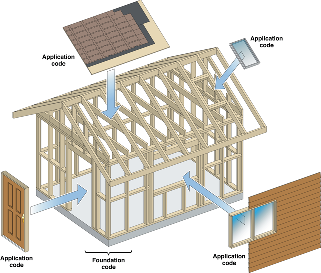

Integrate Your Code with the Frameworks

===========================================
あなたのコードとフレームワークの統合
===========================================

OS XかiOSのアプリを開発するとき、自分だけではできません。
Appleや他の人が行った作業、つまりObjective-Cフレームワークで開発し集められたクラス上で描画されるでしょう。
フレームワークは実行時に複数のプロセスで共有され得るクラスライブラリで、ソフトウェア開発をサポートするリソースもライブラリと一緒に含んでいます。
CocoaやCocoa Touchフレームワークは、アプリの一部（たいてい大部分）を構築するために、一緒に働いている相互に作用するクラスのセットを提供しています。

C言語関数のライブラリでは、プログラムを多かれ少なかれ、どの関数を使い、いつ呼び出すかをピックアップして選択することができます。
一方で、フレームワークは、あなたのプログラムに設計を課します。すくなくとも、特定の問題においてプログラムが対処しようとします。
オブジェクト指向型のフレームワークを使用するとき、あなたはプログラム上の多くの処理を行うために、フレームワークのクラスのメソッドを呼び出すことができます。これはちょうど、手続き型のプログラムのような形です。
しかし、汎用的なフレームワークの動作をカスタマイズする必要がありますが、適切なタイミングでフレームワークが呼び出すメソッドを実装することで、あなたのニーズに適応する必要があります。
これらのメソッドをは、あなたのプログラムを特徴付ける動作で補強し、フレームワークによってかされた構造にあなたのコードを導入するフックです。

以下のセクションでは、フレームワークのコードとアプリケーションのコードの間の関係を探ります。

アプリケーションはイベントに駆動する
=======================================

アプリケーションが起動したときに、必要になるものを考慮し、あなたのコードとフレームワークのコードの間の関係のいくつかの洞察を得ることができます。
基本的には、アプリはオブジェクトのコアグループを設定し、それらのオブジェクトに制御を変えます。
ますます多くのオブジェクトが、プログラムの実行として作成されますが、初期のタスクを処理するために、最初に必要とされるすべてのものは十分な構造をしています（つまり、十分なコアオブジェクトのネットワーク）。
ここに２つの主要なタスクがあります。

	- アプリの初期のユーザーインターフェースを描画する
	- ユーザーがユーザーインターフェースを操作したとき、受け取ったイベントを処理する

最初のユーザーインターフェースが画面に表示された後、アプリは外部イベントによって駆動されます。ここで最も重要なことは、ユーザーによって発信されたものがどれかということです（たとえば、ボタンクリックによる）。
オペレーティングシステムは、アプリケーションに、情報と一緒にイベントをレポートします。
あなたのコードとフレームワークのコードの両方からなるアプリケーションは、イベントを処理し、それに応じてユーザーインターフェースを更新します。

アプリケーションは、イベントを取得し、多くの場合はユーザーインターフェースの一部を描画することで、それに応答します。それから、次のイベントを待ちます。
ユーザーか、（タイマーのような）他のソースがイベントを開始する限り、アプリケーションは次から次へとイベントを取得し続けます。

イベントを取得したり、イベントに応答するメカニズムはメインイベントループにあります。
アプリケーションのコアオブジェクトのグループ内で、あるオブジェクト（グローバルアプリケーションオブジェクト）が、メインイベントループを管理する責任を負います。これは、イベントを取得し、オブジェクトか、最も上手く処理するオブジェクトに送出し、それから次のイベントを取得します。

この図は、OS X内のCocoaアプリのためのメインイベントループを示しています。

	.. image:: images/main_event_loop_2x.png
		:scale: 40

オブジェクト指向型のフレームワークを使用する
==============================================

CocoaとCocoa Touchフレームワークは、彼らのサービスを提供している個々のクラスの寄せ集め以上です。
これらは、オブジェクト指向型フレームワークを含んでおり、それは、問題の空間を構築し、統合されたソリューションを定義するクラスのコレクションです。
必要に応じて使用することができる個別のサービスを提供する代わりに、フレームワークは綿密に計画し、あなたのコードが適応する必要があるアプリケーション全体の構造を実装しています。
このアプリケーション構造が汎用的であるために、特定のアプリケーションの要件を満たすことを専門に扱うことができます。
ライブラリ関数を埋め込むアプリケーションを設計するよりは、フレームワークによって提供された設計にアプリケーションのためのコードを埋め込みます。

フレームワークを使用するためには、フレームワークが定義しているアプリケーション構造を受け入れる必要があります。そして、その上で、特定のアプリの構造を整形するのに必要な限り多くのクラスを使用し、カスタマイズします。
フレームワークのクラスは、相互に依存しており、個別ではなく、グループとなっています。
一見すると、フレームワークのアプリケーション構造にあなたのコードを適応させる必要性が限定的に見えてくるかもしれません。しかし、現実はまったく逆です。
フレームワークは、一般的な動作を変更、拡張できる多くの手段をあなたに提供します。
これは、それらすべて同じ構造の上にあるために、単純にあなたがすべてのアプリケーションが同じ基本的な方法で動作することを受け入れることが必要です。
広義の比喩表現では、Objective-Cはフレームワークは家の骨組みのようなもので、アプリケーションコードはドアや窓、サイディング、他の家の構成要素といったものです。

フレームワークを使用したり、あなたのコードとフレームワークを統合するという観点から、クラスの２つの一般的な種類があります。

	- **Off the shelf:** 一部のクラスは、off-the-shelfオブジェクト（使用する準備ができているオブジェクト）を定義しています。あなたは、単にクラスのインスタンスを作成し、必要に応じてインスタンスを使用します。

	- **Generic:** 一般的なフレームワーククラスで、

