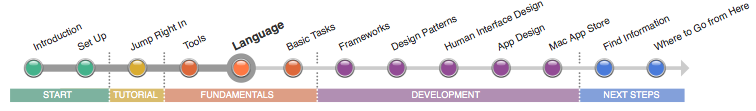

=======
言語
=======

Objective-Cは、すべてのMac アプリケーションに機能を与えるオブジェクト指向言語です。
アプリケーションを作成するためにObjective-Cのコードを書き、多くのアプリケーションフレームワークを使用するためにもこの言語を理解することが必要です。
Objective-Cなしにアプリケーションをビルドすることはできません。

	.. image:: ../images/fundamentals/language_2x.png
		:scale: 50

Objective-Cは、学びやすい構文や規約のシンプルな言語です。もしも、JavaやC++のような他のオブジェクト指向の言語を学んだことがあればなおさらです。
もしも、あなたがCのプログラマーであれば、オブジェクト指向言語やObjective-Cに詳しくなってきたら、アプリケーションの設計や変更が容易になることに気づくでしょう。

.. Note::

	**この記事を読みましょう:** 「:doc:`Write Objective-C Code <../../WriteObjectiveC/write_objective-c_code>`」では、定義、メソッド、メッセージング、プロパティの定義等、Objective-Cの構文の基礎を教えます。Objective-CはMacとiOSで使用します。
	もしも、あながiOS開発者であれば、すでに基本的な構文は知っているはずです。

