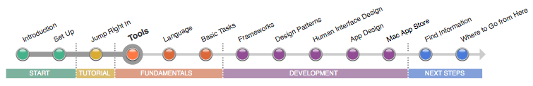
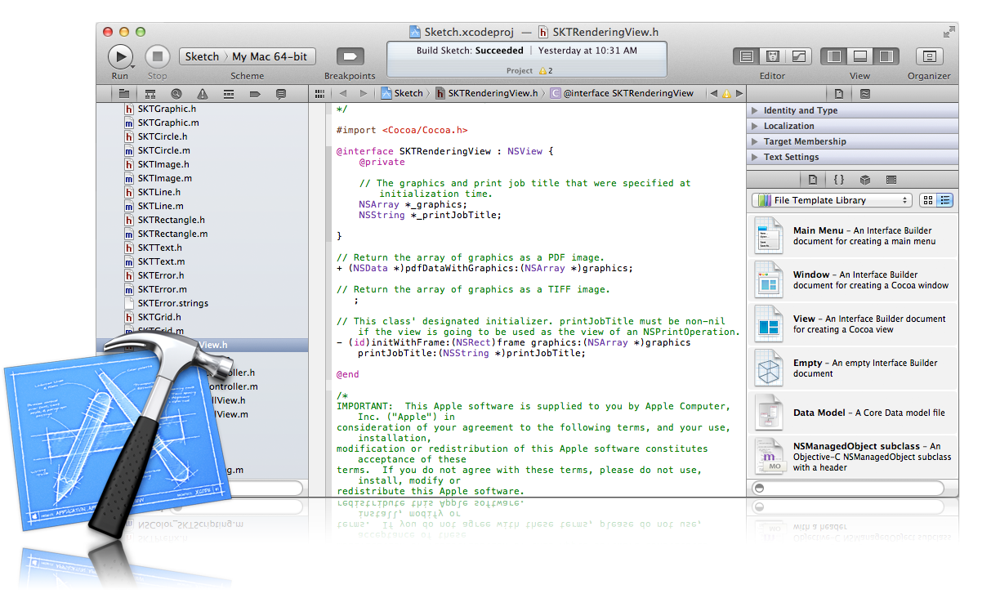

=================
ツールについて
=================

Xcodeはアプリケーションの作成、UIの設計、テスト、最適化、Mac App Storeへの出荷といった開発の全体の流れを扱うツールです。
Xcodeをあなたのワーキングスタイルに合わせてカスタマイズできますし、開発作業に集中できるように手元においておくこともできます。

「Your First Mac App」では、新規プロジェクトの作り方、UI部品の追加方法、ソースコードの編集方法を学びました。
アプリケーションが作成したら、コードのデバッグ、パフォーマンスの分析と向上、ソース管理、アプリケーションの保存とMac App Storeへの提出等々にXcodeを使用します。

.. Note::

	**この記事を読みましょう:** 「:doc:`Manage Your Sorkflow in Xcode <../../ManageYourWorkflowInXcode/manage_your_workflow>`」では、Mac アプリケーション開発に置けるXcodeの特徴について解説しています。
