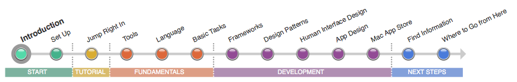
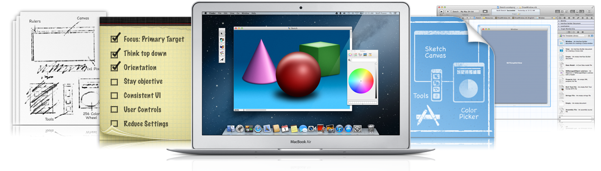

=======
導入
=======

----

今日から始めるMacアプリケーション開発
=====================================

あなたは、すばらしいMacアプリを作りたいけどどこから始めたら良いか分からないのですか？
このロードマップは、たとえあなたがiOSアプリ開発のエキスパートでなくても、Macアプリ開発の開始点を提供してい0ます。
Appleは、アプリを作成しそれらをMac App Storeを通して配信することを容易にしてくれます。
このロードマップに従うことで、必要なツールの入手方法を学び、主なコンセプトやベストプラクティスを理解し、より多くの情報を探すためにどこを見れば良いかを学ぶことができます。

このロードマップを進めると、単純なMacのアプリケーションを作成するために、Appleの統合開発環境である「Xcode」を利用することになるでしょう。
すべてのMacアプリケーションやフレームワークを動作させるための言語である「Objective-C」を使ったプログラミングの基礎を学んでいきます。
そして、Cocoaプログラミング環境を探求し、作成したアプリケーションを「Mac App Store」に提出する方法を学んで行きます。

ロードマップの各ページは、新しいトピックやトピックに関するリンクやちょっとした記事を紹介しています。
このロードマップは、開発を始めるためのある程度の知識を提供します。そして、最後のページには、ここを終えてどこへ行くべきか、次に読むべきドキュメントのリンクが記載されています。
このロードマップを終えたら、よりたくさんの独立したトピックについて、理解するための準備ができています。
あなたは、Macアプリケーション開発をスタートさせるための「知識」「ツール」「技術」を手に入れたのです。

.. Note:: 

	あなたがiOSデベロッパーの場合：Macアプリケーション開発に関する多くの知識をすでに知っていることでしょう。このロードマップに従う場合は、プラットフォームの違いに焦点を置いてみてください。同じ言語と同じツールを使用していますが、「iOS」と「OS X」の開発では、いくつかの重要な違いが存在しています。

