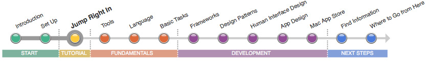

とにかくやってみよう
=====================

Macアプリケーションを作るためには、たくさんのことを学ぶ必要があります。しかし、このツールは簡単なアプリの作成と実行を簡単にしてくれます。
「Your First Mac App」チュートリアルでは、ツールの紹介、デザインパターンの基礎、
アプリケーション開発のプロセスについて解説しています。
このチュートリアルを通して、音量コントロールをシミュレートするアプリケーションを作成します（同じコントロールを制御する複数の入力フォームを持っています）。
このチュートリアルの簡単なステップにより、これからの開発で何度も使用する、エレガントで有用な概念を学ぶことができます。

.. image:: ../images/tutorial/jump_right_in2.png
	:scale: 60

「Your First Mac App」は、ロードマップの中で一番長い記事ですが、焦らないでください。これは、あなたがこれから学ぶであろうたくさんの概念の基礎となっている部分です。
各記事はそれらの概念の１つを詳細に説明しています。

.. Note::

	**いますぐチュートリアルを始めよう:** 「:doc:`Your First Mac App <../../YourFirstMacApp/index>`」は、あなたをOS X の開発環境に順応させながら、シンプルなアプリケーションの作り方を教えてくれます。
	チュートリアルが終わったら、このページに戻ってきて、「今日から始めるMacアプリケーション開発」の続きを行ってください。

