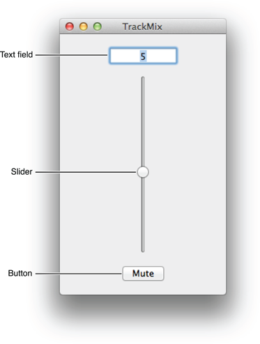

導入
======

初めてのMacアプリケーション作成
---------------------------------

「Your First Mac App」は、Macアプリケーション開発における **３つのT** を紹介します。

 - **Tools:** プロジェクトの作成や管理のためのXcodeの使い方
 - **Technologies:** ユーザー操作に反応するアプリケーションの作り方
 - **Techniques:** すべてのMacアプリケーション開発の基礎となる重要なデザインパターンの有用性

では、オーディオトラックの音量をセットできる１組のコントロールを持ったアプリケーションを作ってみましょう。
複数のオーディオトラックの音量を独立してコントロールできるアプリケーションを想像したかもしれませんが、このアプリケーションに存在するオーディオトラックは１つだけです。
このチュートリアルのすべてのステップを終了したら、次のようなアプリケーションが出来上がっているでしょう！

上の画像のように、これから作成するアプリケーションには、メインとなる３つのユーザーインターフェース（UI）があります。

 - テキスト領域(音量を入力することができます)
 - スライダー(音量をグラフィカルに設定できます)
 - Mute ボタン(トラックのボリュームを０にします)

完成したアプリケーションを起動したら、テキスト領域に音量を入力してみてください。すると、スライダーがそれに応じて更新されます。同じ様に、スライダーを動かしたらテキスト領域の現在の音量が更新されます。
Muteボタンを押したときは、音量が０に設定されるはずです。

一般的なプログラミング言語、とりわけ、オブジェクト指向言語、Objective-C言語の基礎ができていれば、このチュートリアルからより恩恵を受けられるでしょう。
もしも今までにObjective-Cを使ったことがなくて、このチュートリアルを理解するのが難しいと感じても、心配しないでください！
「Start Developing Mac Apps Today」ロードマップを終える頃には、もとソースコードのことがよく分かるようになっているはずです。