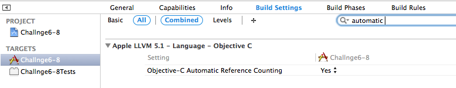

.. index:: ARC

ARC(Automatic Reference Counting)
======================================

オブジェクトのリファレンスカウンタを管理するためのコードを、コンパイラが自動的に生成してくれる仕組み。

例）

.. code-block:: objective-c

	s = w;

ARCはこの代入文をコンパイルして、次の記述に相当するコードを出力します。

.. code-block:: objective-c

	[w retain];    // w のオーナーシップを得る.
	id _old = s;  // _oldは一時的な変数かレジスタとする.
	s = w;      // 新しい値の代入後、s の古い値のオーナシップを放棄
	[_old release]; // （オブジェクトの解放が s に再び波及する場合を考慮）

ARCを利用する場合のプログラム記述上のルール
---------------------------------------------

− 手動のカウンタ操作の禁止

ARCを用いてコンパイルするプログラムには、リファレンスカウンタの操作に関するコードを記述していはいけません。具体的には、以下のメソッドを呼び出してはいけません。

.. code-block:: objective-c

	retain
	release
	autorelease
	retainCount

自動解放プールの新しい構文
-----------------------------

NSAutoreleasePoolを使用してはなりません。
自動解放プールを設定する場合、新しい構文として用意された@autoreleasepoolを使います。

- 手動のカウンタ管理方式

.. code-block:: objective-c

	id pool = [[NSAutoreleasepool alloc] init];
		/* 一連の作業を行う */
		/* この位置で break や return、goto などを使うことはできない */
	[pool release];	/* インスタンスはここで解放される. */

- @autoreleasepool を用いた新しい構文

.. code-block:: objective-c

	@autoreleasepool {
		/* ここで一連の作業を行う. */
		/* break や return、goto 等を使っても良い. */
	}

.. Note::

	手動の管理方式の場合であっても、新しい記法が利用でき、新しい記法の方がかなり高速に動作するので、どちらの管理方式の場合も新しい記法を利用することが推奨されている。

ARCを使ったプログラムをコンパイルする
---------------------------------------

ARCを使用したコードをコンパイルするには、コンパイラとしてgccではなくclangを使用し、コンパイルオプションに「-fobjc-arc」を与える必要があります。逆に、ARCを使用しないことを明示的に示すためのオプション「-fno-objc-arc」も用意されている。

XCodeを使用している場合は、ビルド設定の以下の項目を「Yes」にしておきます。

ARC基本事項まとめ
-----------------------

- カウンタの操作を記述しない。retain、release、autorelease、retainCountメソッドを呼び出したり、再定義してはならない。

- 自動解放プールのクラスNSAutoreleasePoolを使わない。自動解放プールは新しい構文である「@autoreleasepool{}」を使用すること。

- init、new、copyで始まるセレクタを持つメソッドを不用意に定義しないこと。

- dealloc でインスタンス変数を解放する必要はない。また、スーパークラスのdeallocを呼び出す必要もない。

- コンパイラにはclangを使い、オプションとして「-fobjc-arc」を与える。

.. Note::

	XCodeには、手動のカウンタ管理方式のプロジェクトをARC対応に変換する機能が用意されています。
	メニューの「Edit＞Convert to Objective-C ARC...」を選択します。

