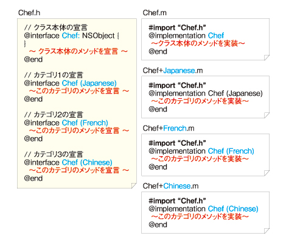

=============
カテゴリ
=============

カテゴリとは
===============

あるクラスの一部分のメソッドを実現するモジュールを **カテゴリ** (category)と呼びます。クラスはカテゴリを使わないこともできますし、多数のカテゴリから構成されるようになっていても構いません。

カテゴリはクラスと同様にインターフェース部で宣言を記述し、実装部にその定義を記述します。ただし、インスタンス変数を宣言することはできません。
また、カテゴリはメソッドのみを含み、メソッドにはインスタンスメソッドとクラスメソッドの両方を書くことができます。

* カテゴリの宣言

.. code-block:: objective-c

	@interface ClassName (CategoryName)
		funcA; /* メソッドの宣言 */
		...
	@end

* カテゴリの実装

.. code-block:: objective-c

	@implementation ClassName (CategoryName)
		funcA  /* メソッドの定義 */
		{
		}
		...
	@end

- カテゴリ名は重複していなければ、どんな名前でも良い
- インスタンス変数は宣言できない
	- インスタンス変数へのアクセスは可能
- インターフェース部にない、局所的なメソッドの定義やCの関数は書いても構わない 

ファイルの分け方
===================

典型的には、メインのインターフェース部を含むヘッダファイルに、他のカテゴリのインターフェース部も含めてしまい、それぞれのカテゴリの実装部を別ファイルに記述するという方法がとられています。
ファイル名は「クラス名＋カテゴリ名.m」とするのが標準とされています。

(例)

.. Note::

	メインのインタフェース部のヘッダファイルに変更を加えたくない場合や、カテゴリ毎に並列して開発作業を進める場合等には、カテゴリのインターフェース部を別のヘッダファイルにすることがあります。なお、それぞれの実装ファイルは個別にコンパイル可能です。

カテゴリにインターフェース部については以下の原則を守りましょう。

- カテゴリのインターフェース部は、メインのインターフェース部を参照していなければならない

- カテゴリの実装部は、対応するインターフェース部を参照していなければならない

- あるカテゴリのメソッドを使用する場合、呼び出し側では、そのメソッドを含むインターフェース部を参照していなければならない

.. Note::

	ここで言う「参照する」というのは、同じファイル内の前方に存在するか、別ファイルにあるものをインポートすることを表します。

既存クラスへのカテゴリの追加
============================

カテゴリを利用することで既存のクラスに新しいメソッドを付け加えることもできます。
もととなるクラスは、自分で定義したものでも、システムが提供しているものでも構いません。

（例）
- NSString+PathComp.h

.. code-block:: objective-c

	#import <Foundation/NSString.h>

	@interface NSString (PathComp)
	- (NSString *)stringByAppendingPathComponents:(NSString*)str, ... NS_REQUIRES_NIL_TERMINATION;
	@end;

- NSString+PathComp.m

.. code-block:: objective-c

	#import "NSString+PathComp.h"
	#import <Foundation/NSPathUtilities.h>
	#import <stdarg.h>

	@implementation (PathComp)
	- (NSString*)stringByAppendingPathComponents:(NSString*)str, ...
	{
		va_list varglist;
		NSString *work, *comp;

		if (str == nil) 
			return self;
		work = [self stringByAppendingPathComponent:str];
		va_start( varglist, str );
		while ((comp = va_arg(varglist, NSString*)) != nil)
			work = [self stringByAppendingPathComponent:comp];
		va_end( varglist );
		return work;
	}
	@end

