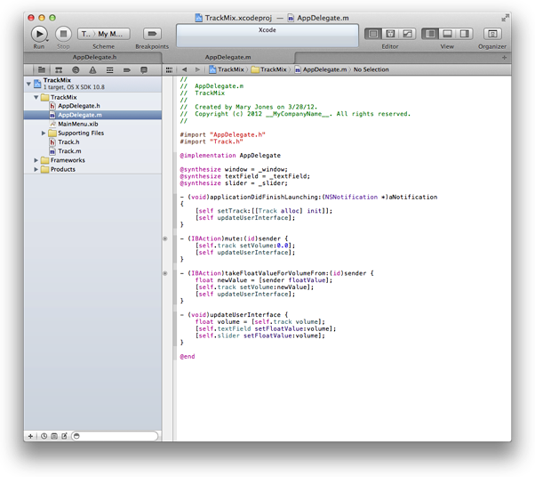
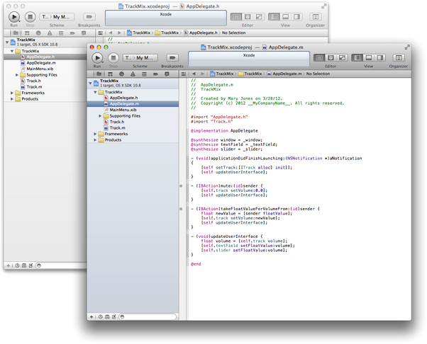
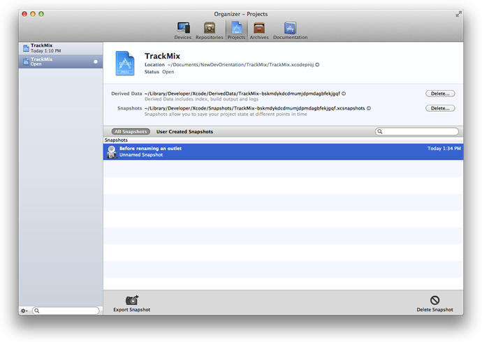
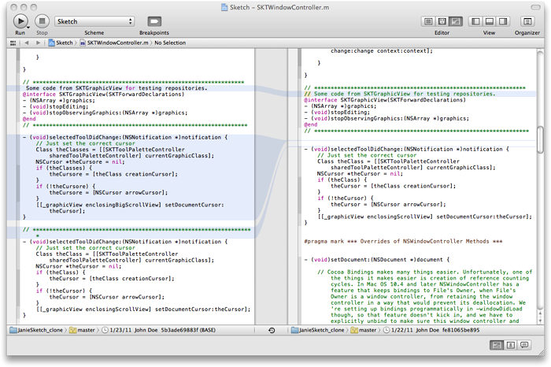
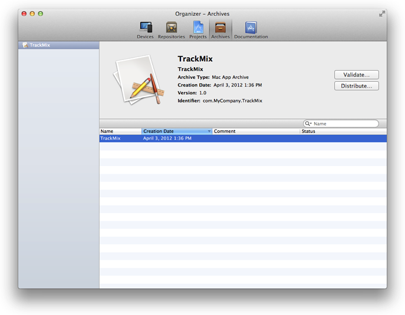

=======================
ワークフローの管理
=======================

「Your First Mac App」チュートリアルで見たように、Xcodeのワークスペースウィンドウ内の主なワークフローを学びました。
Organizerウィンドウは、ドキュメント読んだり、ソースのリポジトリを管理したり、アプリケーションをMac App Storeに提出する準備をしたりするような操作を補助する役割があります。

ワークスペースウィンドウは。ナビゲーターエリア、エディタエリア、ユーティリティエリアがあります。
「Your First Mac App」では、ファイルを編集ファイルを選択するのにナビゲーターエリアを使用し、ソースファイルを編集したり、UI部品を編集したりするのにエディタエリアを使用し、ユーティリティエリアはボタンのタイトルやスライダの初期値を設定するのに使用しました。

--------

ワークスペースをカスタマイズしよう
===================================

ナビゲータエリア、エディタエリア、ユーティリティエリアは色々な組み合わせで非表示にすることができます。
「Your First Mac App」では、ユーティリティエリアの表示/非表示をするのに、ツールバーにあるセレクターを使用していました。
ユーティリティエリアを非表示にすることで、エディタエリアが広くなり、表示することで様々なオブジェクトの属性を調査して選択することができます。

	.. image:: images/utility_button.png

複数の実装を行うために、Safariのようにタブを使用したりするような、他の方法でもワークスペースをカスタマイズして、ワークフロー特有のレイアウトを作ることもできます。
たとえば、１つのタブでヘッダファイルをみて、もう１つのタブで実装ファイルを見ることもできる。

---------

タブにソースコードファイルを表示してみよう
------------------------------------------

1. プロジェクトナビゲータでAppDelegate.hを選択してソースエディタにヘッダファイルを表示しましょう。

2. 「View > Show Tab Bar」を選択します。

3. 「File > New > Tab」を選択します。

4. プロジェクトナビゲーターでAppDelegate.m を選択して、タブに実装ファイルを表示してください。

5. タブをクリックしてソースファイル間を移動してみましょう。

6. タブを閉じるには、マウスポインタをタブに当て、閉じるボタンを押してください。

7. 「View > Hide Tab Bar」を選択することでTabバーを非表示にできます。

------------------

複数のワークスペースウィンドウを作成することもできます。それぞれのタブかワークスペースウィンドウは独立してカスタマイズ可能です。

-----------

ソースコードファイルを複数のウィンドウで開いてみよう
----------------------------------------------------

1. プロジェクトナビゲータのAppDelegate.hを選択して、ソースエディタにヘッダファイルを表示してください。

2. 「File > New > Window」を選択して、新しいワークスペースウィンドウを表示してください。

3. プロジェクトナビゲータのAppDelegate.mを選択して、新しいウィンドウに実装ファイルを表示してください。

4. Viewセレクターでユーティリティエリアの表示／非表示を変える等、どちらかのウィンドウをカスタマイズしてください。

-------------

コード補完機能による記述の高速化と問題点の自動修正
======================================================

もしXcodeで「You First Mac App」チュートリアルを行ったのであれば、おそらく入力したときにXcodeがコード補完をしてくれていたことに気づいたでしょう。
コード補完の強みを得ることによって、より効率的に、より正確にコードを書くことができます。
また、Xcodeは行中の問題点を検出し、解決方法を教えてくれ、可能であれば修正してくれます。

----------

1. TrackMixプロジェクトで、プロジェクトナビゲータのTrack.hを選択してTrackクラスのヘッダファイルを表示してください。

2. TrackクラスにTrack名を保持するプロパティを追加してください。Xcodeで「@」を入力すると、選択可能な補完候補を表示してくれます。以下のように見えるはずです。

	.. image:: images/code_completion.png

3. 続いて、「@p」まで入力すると「@property」だけが表示されます。「Return」を押してください。

4. コード補完を利用して、以下のコードを追加してpropetyの定義を完了してください。
	.. code-block:: objective-c

		@property (copy) NSString* name

	.. Note::

		*Tip:* Xcodeでリストされているようシンボルを選択して挿入したいときは、Returを使ってください。入力したキーワードの補完やパラメータ間をジャンプしたいときはTabキーを使ってください。

5. Xcodeの横の部分警告が出ているのが分かるかと思います。警告のアイコンをクリックすると診断内容が表示されます。

	.. image:: images/fix_it.png

6. 定義を入力したので、Xcodeはセミコロンを期待しています。Xcodeからの修正を許可するためにReturnを押してください。

--------

XCodeのヘルプを早く探す
============================

アプリケーションの開発途中では、Xcodeでたくさんの作業を行います。やるべきことに対する助けが必要であれば、Xcodeはワークフローのヘルプを提供してくれます。そして、それはXcodeのUIから直接アクセスすることが可能です。
このヘルプは分かりやすいステップになっていたり、ビデオやスクリーンショットがあり、すぐに作業に戻れるように、簡潔に書かかれています。

--------

Xcodeのヘルプを表示しよう
---------------------------

1. TrackMixプロジェクトでのプロジェクトナビゲータでAppDelegate.hを選択して、ソースエディタにヘッダファイルを表示します。

2. もしこのドキュメントをXcodeのDocumentation Organizerで読んでいたら、Go Backボタンがあるはずです。後の残りのステップの後で「Go Back」ボタンを押して、このドキュメントに戻ってください。

	.. image:: images/go_back.png

3. ソースエディタ内の任意の場所でControl-Clickをしてください。
	「Source Editor Help」が最後の項目にあるコンテキストメニューが表示されます。

4. 「Source Editor Help」を選択してソースエディターの一般的な処理の一覧を表示します。
	.. image:: images/source_editor_help.png
 
5. Document Organizerでヘルプ記事を見るためには、「Source Editor Help > "Catching Mistakes with Fix-it"を選択してください。

6. サムネイル画像をクリックして、チュートリアルビデオを再生してください。

---------

アプリケーションのパフォーマンスを向上させよう
===============================================

ソフトウェアの最高のユーザーエクスペリエンスの提供を保証するために、アプリケーションが起動している間のパフォーマンスを分析するめの、InstrumentsアプリケーションをXcodeから起動します。
Instrumentsは起動しているアプリケーションからデータをかき集め、それらのデータをグラフィカルタイムラインに表示します。

	.. image:: images/instruments_trackmix.png

あなたのアプリケーションのメモリ使用状況、ディスクの活動、ネットワークの活動、グラフィックパフォーマンス、その他の計測のデータを集めることができます。
一緒にデータを見ることで、改良のための潜在的な部分を見つけるために、アプリケーションの違った面を分析することができる。
UI部品のテストを自動化することもできる。
あなたの変更がアプリケーションのパフォーマンスを向上させたのかを見分けるために、別の時間でのアプリケーションの動作を比較することもできる。

アプリケーションのパフォーマンスを分析してみよう
--------------------------------------------------

1. TrackMixプロジェクオから「Product > Perform Action > Profile Without Building」を選択してください。

2. 「Build & Profile」ボタンをクリックしてください。
	全面にInstrumentsが起動します。

3. 左の列の「OS X」下の「All」を押して、利用可能なトレースのテンプレートを表示します。

4. 「Leaks」のテンプレートを選択して、「Profile」ボタンをクリックしてください。
	Instruments アプリケーションが表示され、TrackMixアプリケーションが起動します。

5. TrackMixのスライダーを上下に動かしたり、TextFieldに値を入力したりしてみてください。

6. Instrumentsアプリの「Stop」ボタンを押してパフォーマンスデータの記録を停止します。

7. TrackMixのメモリアロケーションの調査をするために、Instrumentsの「Allocations」をクリックしてください。

	Trackペインのどこでメモリアロケーションが起きたのグラフは、このプログラムを通してどれくらいの頻度でメモリアロケーションが発生しているかを教えてくれます。

----------

アプリケーションのバージョン管理
=================================

コードを変更したことで不具合が発生したら、削除されたプロジェクトでさえも簡単にもとに戻せるように、Xcodeがスナップショットを作成します。
スナップショットは後で元に戻せるように、プロジェクトの現在の状態を保存します。
XcodeのProjects Organizerはスナップショットの一覧を表示します。

好きなときにいつでも自分でスナップショットを作成することもできますし、毎回のビルドや、検索/置換の実行の前といったような別のタイミングで自動でスナップショットを作成するようにXcodeに設定することもできます。

---------

プロジェクトのスナップショットを作成してみよう
----------------------------------------------

1. TrackMixプロジェクトを開き、「File > Create Snapshot」を選択してください。

2. 名前と説明を入力します。

3. 「Create Snapshot」をクリックします。

4. スナップショットを見るために、「Window > Organizer」を選択してOrganizer ウィンドウを表示します。

5. 「Projects：ボタンをクリックすると、スナップショットの一覧が表示されるはずです。

--------

ソース·コントロール管理（SCM）を使用すると、スナップショットよりもきめ細かいレベルでの変化を追跡することができます。
（ソースコントロール管理はまた、プログラマのチームで作業する場合は、作業を調整するのに役立ちます。）
SCMシステムは、SCMリポジトリ内の各ファイルの各バージョンに関するメタデータを格納し、ディスクに各ファイルの複数のバージョンを保存します。

Xcodeは２つの一般的なSCMシステムである「Git」と「Subversion」に対応しています。
Xcodeには、どちらのシステムからリポジトリに保存されたファイルであっても容易に比較できるバージョンエディタが含まれています。
もしもあなたのコードにバグがあるのがみつかったら、正しく動いていた以前のバージョンと最新バージョンのファイルとの違いを比較することができ、ソースコードの問題の原因を０にするのに役立ちます。

----------

アプリケーションの配布と発行
==============================

Xcodeは作成したアプリケーションをテストをするユーザとシェアしたり、Mac App Storeに登録するのを簡単にしてくれている。
Xcodeでアプリケーションのアーカイブを作成するために、sheme エディタを使用して配布のプロセスを始めます。

アプリケーションの発行の準備ができたら、Mac App Storeのアプリの発行に必要不可欠な批准テストをArchives Organizerを使用して行います。
これらのテストをパスすることで、アプリケーションの認可のプロセスをできるだけ早く住むことを保証します。
XcodeからMac App Storeに直接登録する準備ができました。

このロードマップのさらに後で登場する「Prepare for MAc App Store Submission」とう記事でより詳しく、アプリケーションの配布と発行について学びます。

