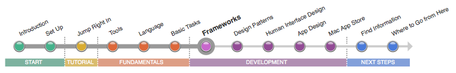

==================
フレームワーク
==================

アプリケーションは、あなたが書いたコードとAppleが提供しているフレームワークによって構成されています。
フレームワークは、アプリケーションで呼び出すことができるメソッドをのライブラリが含まれています。
複数のアプリが同時にhレーブワークのライブらrにアクセスすることが可能です。

	.. image:: ../images/development/framework_2x.png
		:scale: 50
		:align: center

開発するアプリケーションは複数のフレームワークにリンクするでしょう。
Application Programming Interface（API）を介して、フレームワークを利用することができます。
ヘッダファイルに掲載されているAPIは使用可能なクラス、データ構造、プロトコルを指定しています。
アップルは、あなたが実装したいであろう基本的な機能を予測したフレームワークを書いています。
時間と労力の節約するためとコードが効率的かつ安全であることを確認するための両方の点において、あなたはフレームワークを使用すべきです。
システムフレームワークは、基盤となるハードウェアにアクセスするための唯一の方法です。

.. Note::

	 **これらの記事を読みましょう**

	- 「:doc:`Survey the Major Frameworks <../../SurveyTheMajorFrameworks/index>`」は、アプリケーションの開発に置いて最も一般的であるフレームワークについて説明しています。また、OS XとiOSのAPIの相違点と類似点のいくつかにもついても簡潔にて説明しています。

	- 「:doc:`Integrate Your Code with the Frameworks <../../IntegrateYourCodeWithTheFrameworks/index>`」は、Objective-Cフレームワークにあるメソッドの種類について説明し、どのようにしてあなたのアプリケーションのコードとフレームワークのコードを統合するかを説明します。OS XとiOSのAPIの間には違いはありますが、アプリケーションとフレームワークの間の関係は一般的に同じです。

