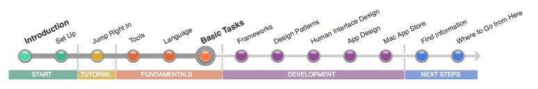
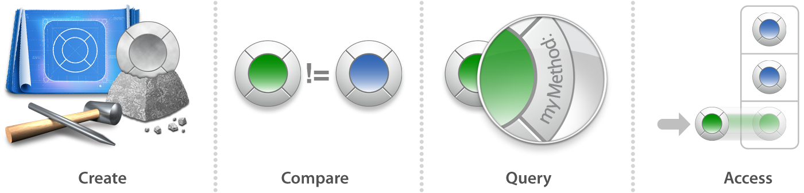

=========
基礎
=========

ここまでに、基礎的なコードを読み書きするために、Objective-Cについて十分学んできたことと思います。そうすると、今度はオブジェクトの観点から考えることができます。
現実世界に置けるオブジェクトに着いて考えるのと同じように、オブジェクトが何を含んでいるか、それで何ができるか、他のオブジェクトとどのように関係しているか、といったことを考える必要があります。

Macアプリケーションプログラミングでは、オブジェクトの生成、オブジェクトの比較、オブジェクトの情報の照会、配列のようなコレクションオブジェクトへのアクセス、をどのように行うかを知っておく必要があります。
これらのスキルを習得すれば、より複雑なObjective-Cのコードを扱う準備ができています。

.. Note::

	**この記事を読みましょう:** 「:doc:`Acquire Foundational Programming Skills <../../Acquire_Foundational_Programming_Skills/acquire_foundational_programming_skills>`」はObjective-Cプログラミングにおける、基礎的なタスクを説明しています。
	この記事で説明されている概念は、MacやiOSの開発において基本的には同じです。

