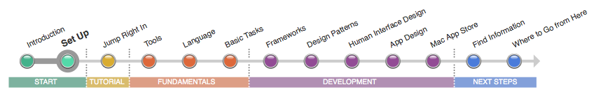
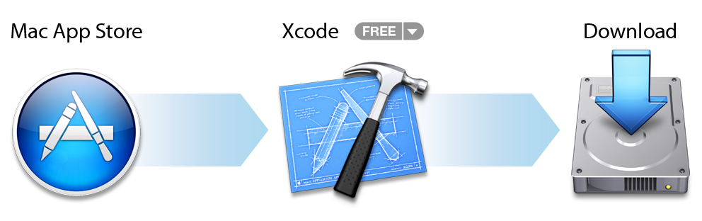

=======
準備
=======

----

準備
======

アプリケーションを開発するとき、「Xcode」という、Appleの統合開発環境(IDE)を使用します。
XcodeはMacアプリケーションを作成するのに必要なものをすべて提供してくれます。
例えば、ソースコードエディタ、グラフィカルなユーザーインターフェースエディタ。他にも多くのものが含まれています。
Xcodeは、アプリケーション開発に必要なほとんどのツールを提供している「ワークスペース(Workspace)」と呼ばれる1つのウィンドウを使用しています。
同じウィンドウの中で、スムーズにコード編集からデバッグやユーザーインターフェース設計に移動することができるのです。

開発を始めるために
--------------------

1. 最新バージョンの「Xcode」をダウンロードしてください。

 `AppStore <macappstore://itunes.apple.com/us/app/xcode/id497799835?mt=12>`_ を開いて「Xcode」を検索し、「無料」と書いてあるダウンロードボタンを押してください。
 (Mac App Store アプリケーションは、OSX 10.7移行にインストールされています。もしも10.6以前のOS Xを使用している場合は、アップグレードしてください。)

2. `Mac Deveoper Program への登録 <https://developer.apple.com/programs/mac/>`_

 このプログラムに登録すれば、作成したアプリケーションを配布するのに必要なツールやリソースにアクセスすることができます。これらのツールについては、このロードマップが終わってからより詳しく学んで行くことにしましょう。
