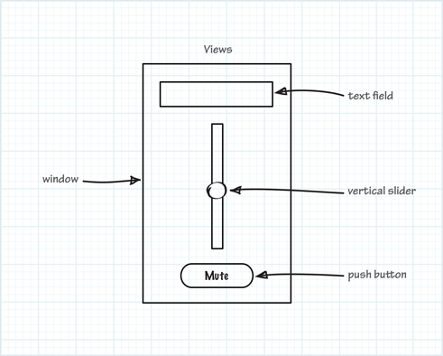

==================
ウィンドウの構築
==================

Xcodeはウィンドウやビューを追加することができるオブジェクトをのライブラリを提供しています。
TrackMixアプリケーションはすでに、テキスト領域やスライダー、ボタンを追加するウィンドウがあります。
そして、これらの要素と作成したクラスを結びつけることができ、次の章ではあなたが必要な処理を実装することもできます。

------

UI部品を追加しよう
===================

オブジェクトライブラリからビューやウィンドウにUI部品をドラッグして追加します。
UI部品が追加されたら、必要に応じて移動やリサイズして配置することができます。

UI部品をウィンドウに追加しよう
-------------------------------

1. プロジェクトナビゲーターの、TrackMixグループの下の *MainMenu.xib* ファイルを選択し、TrackMixウィンドウを表示してください。

2. ツールバーのビューボタンの一番右のボタンを押して、ウィンドウをの右側にユーティリティエリアを表示してください。
    .. image:: images/configuring_the_window/utility_button.png

3. エディタエリアにあるWindowオブジェクトのアイコンをクリックして、ウィンドウを表示してください。

4. ウィンドウの角と淵に隣接している３つのドットをドラッグすることでウィンドウを小さくしてください。
    .. image:: images/configuring_the_window/9_ib_objectlibrary.png

5. オブジェクトライブラリを開いてください。
    オブジェクトライブラリはユーティリティエリアの下部にあります。オブジェクトライブラリが見当たらない場合は、ライブラリ選択バーの左から３つ目のボタンを押してください。
 
    .. image:: images/configuring_the_window/9b_objectlibrarybutton.png

6. オブジェクトライブラリポップメニューから「Cocoa > Controls」を選択します。
    ※Xcode5ではこのメニューはなくなっている。

7. 表示されたリストから、*Text Field*、*Vertical Slider*、*Push Button* を１つずつウィンドウにドラッグしていってください。
    .. image:: images/configuring_the_window/9c_objectlibrarysearch.png

------

リサイズハンドルを使って項目をリサイズし、ドラッグで適切な位置に配置してください。
Viewの中で部品を動かすと、青点線でアライメントガイドが表示されます。

-----------

適切にUI部品をレイアウトしてみよう
-----------------------------------

1. *Text Field* をウィンドウ上部に近づけ、水平中心に来る様にドラックしましょう。
    *Text Field* （どんなUI部品でも）を移動させると、「アライメントガイド」と呼ばれる青点線が表示され、ビューの端や中心をそろえる手助けをしてくれます。
    *Text Field* を、以下の画像のようにアライメントガイドが表示されるまで移動してください。

    .. image:: images/configuring_the_window/13_dragtextfield.png

2. *Vertical Slider* がWindowの中心で *Text Field* の下に来るようにドラッグします。

3. *Vertical Slider* をリサイズする準備をします。

    UI部品の境界に表示される、「リサイズハンドル」と呼ばれる小さい四角をドラッグしてUI部品をリサイズしてください。
    一般的に、UI部品を選択すればレサイズハンドルが表示されます。
    *Vertical Slider* が以下の画像のように表示されていれば、リサイズしてください。以下の様になっていなければ、Canvas上の *Vertical Slider* を選択してください。

    .. image:: images/configuring_the_window/14_resizeslider.png

4. Windowの中心アライメントガイドが表示されるまで *Vertical Slider* の下側を下方向へリサイズしてください。
    以下の画像のように見えたらリサイズをやめてください。

    .. image:: images/configuring_the_window/15_stopresizeslider.png

5. *Button* をWindowの底辺付近に水平中心になるようにドラッグしてください（*Vertical Slider* の下です）。

---------

*Text Field*、*Vertical Slider*、*Push Button* を追加して、推奨したレイアウトどおりにしていれば、プロジェクトは以下の画像のようになるでしょう。

 .. image:: images/configuring_the_window/10_ib_layout.png

*Attibute Inspector* を使って、UI部品の振る舞いや外観を指定することができます。
まず、*Text Field* に デフォルト文字として５を追加してください。次に、*Vertical Slider* が最小値と最大値を持つように設定しましょう。そして、*Push Button* のタイトルを「Mute」に設定しましょう。

-------

Text Fieldの設定をしよう
---------------------------

1. *Text Field* をクリックして選択し、|attributes_icon| のようなアイコンをクリックして *Atrribute Inspector* を表示します。

 .. |attributes_icon| image:: images/configuring_the_window/attributes_icon.jpg

2. *Attribute Inspector* の一番上のテキスト領域に５を入力してくください。
    これは *Text Field* の初期値となります。また、*Text Field* をダブルクリックすると、TrackMix ウィンドウの *Text Field* に直接入力することもできます。

3. 中心揃えボタンを押して *Text Field* の文字列を中心揃えにします。
    文字を入力し、アライメント設定を変更したら、*Text Field* の*Attribute Inspector* は以下の様になっているはずです。

    .. image:: images/configuring_the_window/16_textfieldattrinsp.png

------

Sliderの設定をしよう
----------------------

1. エディタエリアのスライダーを選択してください。

2. 「Attribute Inspector」の「Value」セクションの「Minimum」フィールドに0と入力してください。

3. 同様に「Maximum」フィールドに11と入力してください。

4. 次に、「Current」フィールドに5と入力してください（TextFieldの設定と合わせてください。）

5. 「Control Attribute」 までスクロールし（見えていなければ）、「Continuos」チェックボックスをオンにしてください。
    スライダーが「Continuos」であれば、値をセットしたときだけでなくスライダを動かしている間、メッセージを送り続けます。

    .. image:: images/configuring_the_window/17_sliderattrinsp.png

-----

Buttonの設定をしよう
----------------------

以下のどちらか一方を行ってください

- *Button* 内部をダブルクリックして「Mute」と入力したら「Tab」キーを押してください。
- *Button* を選択し「Attribute Inspector」の「Title」の項目に「Mute」と入力して「Tab」キーを押してください。

--------

Runボタンを押して（もしくは Product > Runを選択して）、UI部品が期待し通りに設定されて追加されているか確認してください。
正しく設定されていれば、以下の様に表示されます。

 .. image:: images/configuring_the_window/18_runtrackmix.png

UI部品は相互に影響する様にできますが、ここでは、「Mute」ボタンは何もしません。*Text Field* に入力してもスライダーのノブは動きませんし、スライダーを動かしても *Text Field* の文字は変更されません。
このような機能を追加するためには、UI部品と記述したコードを結びつける必要があります。
これらの接続については、次で説明します。

---------

Button, Text Field, Slider に処理を作る
========================================

UI部品を動かしたとき、対応する操作がどのように振る舞うか知っているオブジェクトにメッセージを送ることができます。
この相互作用はCocoaデザインパターンである、*target-action* という仕組みの一部です。

このチュートリアルでは、ユーザーが「Mute」ボタンを押したとき、「トラックの音量を0にしたい」というメッセージ（*action*）を app delegate（*target*）に送りたい。
この場合、app delegate は「Model-View-Controller デザインパターン」でいう、View Controller として働きます。
この *action* メッセージは、app delegate が管理している"model"データ（ここでいうトラックの音量）を変更します。
そして、app delegate はmodelオブジェクトのデータに変更を反映し、他のView（ここでいう *Slider* や *Text Field*）を更新します。
トラックを表すModelオブジェクトを後で作成することにします。

 .. image:: images/configuring_the_window/TrackMixVC.png

Xcodeを使って、UI部品に *action* を設定し、Canvas上のUI部品から対応するソースファイル（例えばAppDelegateクラスのソースファイル）に、Controlキーを押しながらドラッグ(以下ではControl-Dragと表記します)することで、設定した *action* に対応するメソッドを割り当てることができます。
このようにして作成された結合は、UI部品等と一緒にnibファイルの中にアーカイブされます。

----------

Buttonにactionを追加しよう
----------------------------

1. プロジェクトナビゲータのMainMenu.xibファイを選択してアプリケーションウィンドウを表示してください。

2. Xcodeのツールバーにある、「Utilities」ボタン（Viewコントロールボタンの一番右）を押してUtilityエリアを非表示にし、「Assistant Editor」ボタンを押して、Assistantエディタペインを表示してください。
    「Assistant Editor」ボタンは真ん中のエディタボタンで、|assistant_editor_button| のようなアイコンです。

 .. |assistant_editor_button| image:: images/configuring_the_window/assistant_editor_button.jpg

3. Assistantエディタが「AppDelegate」クラスのヘッダファイル（AppDelegate.h）を表示していることを確認してください。
    Assistantエディタの上部の「Top Level Objects」メニューから「AppDelegate.h」を選択してください。

    .. image:: images/configuring_the_window/18b_assistantmenu.png

4. エディタ上で、「Mute」ボタンから「AppDelegate.h」内のメソッド定義エリア（@interface と @end の間）にControl-Dragしてください。
    Control-Dragをするには、ボタンからAssistantエディタペインのヘッダファイルまでドラッグしている間「Control」キーを押したままにしてください。

    .. image:: images/configuring_the_window/19a_buttonconnection.png

    Control-Dragをやめると、Xcodeがaction の接続を設定できるポップオーバーを表示し、すぐに *action* を作成することができます。

      .. image:: images/configuring_the_window/19_buttonconnection.png

5. ポップオーバー内でButtonの *acton* の設定を行います。
    - 「Connection」ポップアップメニューで「Action」を選択します。
    - 「Name」には「mute:」と入力します
 	    後のステップで、音量を０に設定する mute: メソッドを実装します。
    - 「Type」がidになっていることを確認します。
    	この「id」はあらゆるCocoaオブジェクトを表しています。どんなタイプのオブジェクトがメッセージを送っているかはここでは問題ないので「id」を使いたいのです。

 *action* の接続設定ができたら、以下の様になっているはずです。

    .. image:: images/configuring_the_window/20_buttonconnection2.png

6. ポップオーバーの「Connect」をクリックします
    Xcodeがヘッダファイルに関数定義を追加し、実装ファイルに関数のスタブを作成してくれます。
    Xcodeでは、以下の画像のように関数の左側に中身が塗りつぶされた○を表示することで、接続が作成されたことを表しています。

    .. image:: images/configuring_the_window/21_buttonactionmethod.png

---------

Text Fieldにactionを追加しよう
--------------------------------

1. *Text Field* から「AppDelegate.h」の関数定義領域にControl-Dragします。

 .. image:: images/configuring_the_window/22a_textfieldconnection.png

2. Control-Dragを話したら、ポップオーバーが表示されるので、*Text Field* のaction接続の設定を行います。
    - 「Connection」ポップアップメニューで「Action」を選択します。
    - 「Name」には「takeFloatValueForVolumeFrom:」と入力します。
 	    あとのステップで、Modelデータをセットし、*Text Field* と *Slider* を同期させる「takeFloatValueForVolumeFrom:」メソッドを実装します。
    - 「Type」が「id」となっていることを確認します。

3. 「Connect」をクリックします。
    Xcodeがヘッダファイルに関数定義を追加し、実装ファイルに関数のスタブを作成してくれます。
    Xcodeでは、以下の画像のように関数の左側に中身が塗りつぶされた○を表示することで、接続が作成されたことを表しています。

    .. image:: images/configuring_the_window/22_textfieldactionmethod.png

-------------

ここまでで、*Button* と *Text Field* から「AppDelegate.h」ヘッダファイルにControl-Dragしたことで、２つのことができています。
    - UI部品とapp delegateオブジェクトの接続を作成しました。
 	    例えば、nibファイルがロードされたとき、ボタンの *target* はapp delegate にセットされ、*action* には「mute:」メッセージがセットされます。これにより、*Button* がクリックされたときに、app delegate に「mute:」mセッセージが送られます。
 	    （Objective-Cでは、オブジェクトは互いにメッセージをお送り合い、Objective-C ランタイムがどのメソッドを実行するかを決定しています。）

    - 「AppDelegate」クラスに対応するコードを追加しました。
 	    具体的に言うと、「AppDelegate.m」に以下に示すようなメソッドをのスタブを追加し、「AppDelegate.h」には対応する関数定義を追加しました。

      .. code-block:: objective-c

        - (IBAction)mute:(id)sender {
          }

        - (IBAction)takeFloatValueForVolumeFrom:(id)sender {
          }

.. Note::

	IBAction は、*target-action* コネクションの *action* として働く関数としてXCodeが扱うために使われ、常にこれが使用されます。

	*action* メソッドにおける「sender」パラメータは、*action* メソッドを呼び出したオブジェクトです。
	これは、メッセージがどのオブジェクトから送られてきたか初めにチェックしたり、処理を行う前にオブジェクトが他に情報を持っていないか確認するために、共通で使われるオブジェクトです。（このチュートリアルでは、「mute:」メソッドを *sender* は *Button* ですが、「takeFloatValueForVolumeFrom:」メソッドの *sender* は *Text Field* か *Slider* になります。）

----------

Slider の target と action を設定しよう
----------------------------------------

1. エディタエリアの左側部分のWindowアイコンの下にある「App Delegate」の青いキューブに *Slider* からControl-Dragしてください。（青いキューブはオブジェクトを表しています）

    Xcodeは「AppDelegate」クラスで提起されている *action* メソッドのリストを表示します。

 .. image:: images/configuring_the_window/22b_slideraction.png

2. Control-Dragを離したら「takeFloatValueForVlumeFrom:」メソッドを選択して、接続します。

--------

Text Field と Slider の Outlet を作成しよう
============================================

「Outlet」は２つのオブジェクトが接続されていることを表している。nibファイルの中のオブジェクト（Text Fieldのようなもの）とやりとりするために、オブジェクト（app delegate)のようなもの）が欲しいとき、outletのようなオブジェクトを指定します。
ランタイムでnibファイルがロードされたとき、Xcodeで作成したoutletが格納され、他のオブジェクトと互いにやりとりをすることができるようになります。

このチュートリアルでは、ユーザーが *Text Field* に入力した内容を取得して、それに応じて音量を設定し、*Slider* を更新するために、app delegate が必要になります。app delegate は、これらのオブジェクトとやりとりできるようにするために、outlet の接続をそれぞれ作成します。
ここでは、*Text Field* と *Slider* のOutletだけが必要です。app delegate は、*Button* にメッセージを送る必要がないので、*Button* 用のOutletは必要ありません。

*Text Field* と *Slider* にOutletを与えるステップは、*Button* に *action* を追加したときのステップととても似ています。
次に進む前に、エディタに「MainMenu.xib」が表示されていて、Assistantエディタに「AppDelegate.h」が表示されていることを確認してください。

----------

Text Field の outletを追加しよう
---------------------------------

1. Window内の *Text Field* からinterface ファイルの関数定義部分にControl-Dragしてください。
    関数定義エリア内であれば、Control-Dragをどこで離しても問題はありません。
    このチュートリアルでは、新しいOutletはWindow Outletの下に置くことにします。

2. Control-Dragを離すとポップオーバーが表示されるので、*Text Field* の接続を設定しましょう。
    - 「Connection」が「Outlet」になっていることを確認してください。

    − 「Name」に「textField」と入力してください。
 	    Outletにはどんな名前をつけても問題ありませんが、そのOutletが表しているものとの関係性が分かるように名前をつければ、ソースコードの可読性が高くなるでしょう。

    - 「Type」が「NSTextField」になっていることを確認してください。
 	    「Type」を「NSTextField」にしておくことで、XCodeがOutletを *Text Field* としか接続しないように保証できます。

    - 「Storage」ポップアップメニューが「Weak」になっていることを確認してください。これはOutletのデフォルト値です。

    これらの設定ができれば、ポップオーバーは以下のようになっています。
    .. image:: images/configuring_the_window/23_textfieldconnection.png

3. ポップオーバーの「Connect」をクリックしてください。
    .. image:: images/configuring_the_window/24_textfieldoutlet.png

--------------

Slider の Outlet を追加しよう
-------------------------------

1. Window内の *Slider* から、ヘッダファイルの関数定義エリアにControl-Dragしてください。

2. Control-Dragを離したら、ポップオーバーが現れるので、*Slider* の接続設定をします。
    - 「Connection」ポップアップメニューが「Outlet」になっていることを確認してください。
    - 「Name」に「slider」と入力してください。
    - 「Type」が「NSSlider」になっていることを確認してください。
    - 「Storage」ポップアップメニューが「Weak」になっていることを確認してください。

    これらの設定を終えると、ポップオーバーは以下のようになっているはずです。

    .. image:: images/configuring_the_window/25_sliderconnection.png

3. ポップオーバーの「Connect」をクリックしてください。

------------

*Text Field* と *Slider* のOutlet を追加したことで次の２つのことが実現できました。

 - app delegateから *Text Field* と *Slider* への接続が確立されました。
 	  nibファイルがロードされたとき、app delegate の *Text Field* Outlet（Objective-Cのプロパティ） が、「NSTextFile」オブジェクトにセットされ、*slider* Outletが「NSSlider」にセットされます。
 	  これにより、app delgate はこれらのUI部品の値を直接取得したり設定したりできるようになります。

 - AppDlegateクラスに、対応するコードを追加しました。具体的には、以下のPropertyを「AppDelegate.h」に追加しました。

    .. code-block:: objective-c

      @property (weak) IBOutlet NSTextField *textField;
      @property (weak) IBOutlet NSSlider *slider;

.. Note::

  IBOutletはXcodeがオブジェクトをOutletとして扱うためだけに使用します。実際は何も定義されていませんので、コンパイル時間に影響を与えません。

また、これらのProperty（対応するset/getメソッドを作成する）と同期させるために、「AppDelegate.m」に以下のようなコードを追加してください。

  .. code-block:: objective-c

    @synthesize textField;
    @synthesize slider;

ここまでのチュートリアルで、app delegateオブジェクトに全部で５つの接続を作成しました。
 - *Button* の *action* 
 - *Text Field* の *action*
 - *Slider* の *action*
 - *Text Field* の *outlet*
 - *Slider* の *outlet*

--------

app delegate のConnection インスペクターを開いてみよう
--------------------------------------------------------

1. 「MainMenu.xib」見ながら、Standardエディタボタンを押してください。Assistantエディタが閉じて、Standardエディタに切り替わります。
    Standardエディタボタンは、一番左のエディタボタンで |standard_editor_button| のようなアイコンです。

 .. |standard_editor_button| image:: images/configuring_the_window/standard_editor_button.jpg

2. Utilityビューボタンを押して、Utilityエリアを表示してください。

3. エディタエリアの「App Delegate」を選択します。（windowアイコンの下の青いキューブです。）

4. Utilityエリアの「Connections」インスペクターを表示します。
    「Connections」インスペクターボタンは、インスペクター選択バーの |connections_inspector_button| のようなアイコンのボタンです。

 .. |connections_inspector_button| image:: images/configuring_the_window/connections_inspector_button.jpg

----------

「Connections」インスペクター内に、選択したオブジェクトの接続関係を表示します（この場合は、app delegateです）。ワークスペースウィンドウは以下のようになっているかと思います。
    .. image:: images/configuring_the_window/26_inspectconnections.png

app delegateに５つの接続（３つのactionと２つoutlet）が作られているのが分かるかと思います。
*Text Field* と *Vertical Slider* は同じ「takeFloatValueForVlumeFrom:」*action* メソッドを使用しており、これらは「Received Actions」に一緒にグループ化されています。
また、Window と File's Ownerも app delefateに接続されているのが分かるかと思います。
これは、Xcodeがデフォルト接続として提供していて、それらを使う必要はありません。

-----------

アプリケーションのテスト
=========================

アプリケーションを起動していれば、前回UI部品をウィンドウに追加してテストしたときと同じように動作していると思います。
オブジェクト間の接続は存在していますが、*action* メソッドが何も行っていないので、この新しい振る舞いを監視していません。
そこで、作成した接続をテストしてよりよく理解できるようにするために、実装ファイルの「AppDelefate.m」の *action* メソッドにログを出力する処理を追加してください。

--------

*action* メソッドにログを追加しよう
--------------------------------------

1. 左側のペインの「AppDelgate.m 」ファイルを選択しソースエディタに実装を表示してください。

2. 「mute:」メソッドが呼び出されていることを示すために、この関数に単純な「NSLog」を追加しましょう。

    .. code-block:: objective-c

      - (IBAction)mute:(id)sender {
        NSLog(@"received a mute: message");
      }

4. 「takeFloatValueForVlumeFrom:」は以下のように実装してください。

    .. code-block:: objective-c

      - (IBAction)takeFloatValueForVolumeFrom:(id)sender {
        NSString *senderName = nil;

        if (sender == self.textField) {
            senderName = @"textField";
        }
        else {
            senderName = @"slider";
        }
        NSLog(@"%@ sent takeFloatValueForVolumeFrom: with value %1.2f", senderName, [sender floatValue]);
      }

  このメソッドは、どのコントロールがsenderかをチェックし、senderとfloat値を両方ともログに出力します。
  「NSLog」関数は、format string でフォーマットされた文字列をログに出力します。（これはC言語のprintf関数と非常に似ています。）
  %@ という文字列はstringオブジェクトに取って代わることを意味しています。

  このメソッドは、メッセージのsenderを明らかにすることと、メッセージを送り返すという、Cocoaでは非常に一般的なパターンを含んでいます。
  この場合、知りたいのはfloat値だけなので、どのオブジェクトがメッセージを送ったかを知る必要はありませんが、senderも表示しています。

----------

アプリケーションをテストするとき、コンソールを見ればログメッセージが確認できます。

----------

アプリケーションをテストしよう
-------------------------------

1. ツールバーの「Run」ボタンを押してプロジェクトを実行してください。
    TrackMixタスクを停止するかどうか確認するダイアログが表示されたら、「Stop」をクリックしてください。

2. XcodeツールバーのDebugエリアボタンを押して、デバッグエリアを表示してください。
    デバッグエリアボタンはView コントロールボタンの真ん中にあり、|debug_area_button| のようなアイコンです。

  .. |debug_area_button| image:: images/configuring_the_window/debug_area_button.jpg

3. デバッグエリアビューのツールバーの「Clear」ボタンの横にあるボタンの内、一番右のものを押して、Consoleを表示してください。

    .. image:: images/configuring_the_window/27b_consolebutton.png

4. ポップアップメニューの「Target Output」が選択されていることを確認してください。

5. TrackMix内で、*Text Field* に数字を入力してReturnキーを押したり、*Slider* を動かしたり、Mute *Button* を押したりしてください。
    これらのUI部品を操作すると、Consoleにメッセージが出力されているのが確認できるかと思います。

-----------

要約
======

UI部品から「AppDelegate」クラスにCntrol-Dragし、action か outlet を設定することで、UI部品と app delefate オブジェクトの接続を作成しました。
この操作は、オブジェクト間に接続を作成することと、ソースファイルに *action* か *outlet* の必要なコードを追加するという、２つのタスクを行っています。

キャンバスからソースファイルにControl-Dragして接続を作成するときに、自動でコードを追加するというXcodeの特徴は、必ず利用しないと行けない刷毛ではありません。
代わりに、自分でソースファイルにpropertyと関数定義を追加して、エディタエリアでApp DelefateとUI部品の接続を直接作成することも可能です。
しかし、典型的に、Xcodeにこれらの仕事を任せてしまった方がミスは少なくできるでしょう。

今のところ、ユーザーインターフェースは同期していません（*Text Field* や *Slider* は別の値を持っています）。
次の章では、「Model」データをUI部品と分離させるために、「Track」クラスを実装してもらいます。また、*action* メソッドの実装もしていきましょう。
