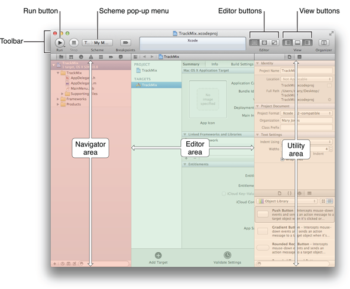
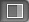

===========
はじめに
===========

このチュートリアルでMacアプリケーションを作成するために、Xcode4.4かそれよりも新しいものを用意してください。
Xcodeは、OS X と iOS 両方の開発に使用するAppleの統合開発環境(またはIDE)です。

.. Note::

	**使用上の注意:** このチュートリアルはタスクを完了するのに必要なステップが、２本の青い線で囲まれた開閉可能な領域でリストアップされています。"新規プロジェクトの作成"のように書かれているタスクを開くには、青い千野内部をクリックしてください。

新規プロジェクトの作成とテスト
=================================

アプリケーションの開発を始めるために、まずはXcodeの新規プロジェクトを作成してみましょう。

----

新規プロジェクトの作成
-----------------------

1. Xcodeを起動します(Applicationsフォルダにあります)。
 	もしも、以前にXcodeでプロジェクトを作成したり開いたりしていなければ、おそらく以下のような「Welcome to Xcode」ウィンドウが表示されるはずです。

 	.. image:: images/getting_started/1_newproject.png

 	もしもすでにXcodeプロジェクトを作成したり開いていた場合は、「Welcome to Xcode」ウィンドウの変わりに、プロジェクトウィンドウが開きます。

2. 「Welcome to Xcode」ウィンドウで「Create a new Xcode project」をクリックしてください。(または、File > New > Projectを選択してください)

 	新しいウィンドウが開き、テンプレートを選択するダイアログが表示されます。Xcodeは、一般的なスタイルのMacアプリケーションを作成するのに使用することが出る、いくつかのテンプレートが組込まれています。

	.. image:: images/getting_started/2_templatedialog.png

3. 画面左のOS Xセクションの「Application」を選択します

4. ダイアログのメインエリアで「Cocoa Application」を選択して、Nextボタンをクリックしてください。

 	新しいダイアログが表示され、アプリケーション名を付けさせたり、プロジェクトの追加オプションを選択したりします。

	.. image:: images/getting_started/3_projectsettingsdialog.png

5. 以下のオプションを選択してください
 	- Product Name : 「TrackMix」との入力してください。
 	- Company Identifier field : あなたの会社の識別名を入力してください。
 	- App Store Category pop-up : 「None」を選択してください。

	.. Note::

		Xcodeはプロジェクトやアプリケーションの名前を付けるために、入力した「Product Name」を使用します。
		これらをシンプルにしておくために、このチュートリアルでは「TrackMix」と名付けられており、クラスプレフィックスは指定していないものとします(プレフィックスはあなたのアプリケーションのクラス名をユニークにして、他のフレームワークのクラスと競合しないようにするために使用されます)。
		このダイアログに表示されている「Organization Name」プロパティは今回のチュートリアルでは使用しません。

6. 「Automatic Reference Counting」オプションが選択されていること、「DocumentExtension」（「Create Document-Based Application」の上にある項目）と「Use Core Data」「Include Unit Tests」オプションが選択されていないことを確認してください。

7. Nextボタンを押します
 	プロジェクトの保存先を決める別のダイアログが表示されます。

8. プロジェクトの場所を決定し、「Source Control」オプションが選択されていないことを確認してから「Create」ボタンを押してください。
 	Xcodeが開き、ウィンドウ内（これをワークスペースウィンドウと呼ぶ）に新しいプロジェクトが開かれます。以下のような画面になっているかと思います。

	.. image:: images/getting_started/4_projectwindow.png

	.. Note::

		Xcodeのバージョンによって、この画面は異なります。

----

ここで、Xcodeが開いているワークスペースウィンドウに慣れるために、もう少し詳しく見てみましょう。
このチュートリアルの残りのセクションで以下のウィンドウのボタンや区別された領域を使用することになります。

もしもUtilityエリアが既に開かれている場合（上の画像のように）、今はこれを閉じておくとよいでしょう。というのも、チュートリアルのもうしばらく後までこの領域は使用しません。
「view buttons」の一番右のボタンがUtilityエリアを制御しています。
Utilityエリアが表示されているときボタンは |utilities_button| のようになります。
必要に応じて、View Buttonsの一番右のボタンを押してUtilityエリアを閉じてください。

まだ、何もコードは書いていませんが、ここで一度Xcodeでアプリケーションをビルドして実行してみましょう。

--------

アプリケーションのビルドとテスト
--------------------------------

1. Xcodeのツールバーにある「Run」ボタンをクリックしてください（もしくは Product > Run を選択してください。）
 	もしも、XcodeがこのMacのDeveloperモードを有効にするかどうか訊ねてくるダイアログが表示された場合は、「Disable」をクリックしてください。

 	Xcodeはプロジェクトをビルドしアプリケーションを起動します。アプリケーションが起動したら、標準のメニューと空のウィンドウがあるはずです。

	.. image:: images/getting_started/5a_trackmix_menu.png

	.. image:: images/getting_started/5_buildandrun.png

2. アプリケーションをテストします
 	ウィンドウをリサイズすることができます。ですが、もしもウィンドウを閉じたら元に戻す方法がありません。ウィンドウをクリックすると丈夫にメニューが表示されているのが分かるかと思います。「TrackMix > about TrackMix」と選択すると、Aboutウィンドウが表示されます。

3. 「TrackMix > Quit TrackMix」を選択してアプリケーションを終了してください。
 	間違えてXcodeのQuitコマンドを選択しないようにしてください、さもないとXcode自身が終了してしまいます。Xcodeの「Stop」ボタンを押すことでアプリケーションを終了させることもできます。

------

このままでは、このアプリケーションは空のウィンドウを表示しているだけで何も面白くありません。この空のウィンドウがどこから来たのかを理解するために、コード中のオブジェクトについて学び、それらが互いににどのように働いてアプリケーションを開始させているかを学ばなければなりません。

アプリケーションの起動について知ろう
=====================================

作成したプロジェクトはXcodeのテンプレートを元にしているため、アプリケーションの基本的な環境が起動したときに自動敵に設定されています。
たとえば、Xcodeはrun loopを元に下アプリケーションオブジェクトを生成します。（run loopは入力されたソースを記録し、インプットイベントをアプリケーションに運ぶことができます。）
この処理のほとんどは、`NSAplicationMain <https://developer.apple.com/library/mac/documentation/Cocoa/Reference/ApplicationKit/Miscellaneous/AppKit_Functions/Reference/reference.html#//apple_ref/c/func/NSApplicationMain>`_ によって実行されます。これは、AppKit frameworkによって与えられ、プロジェクトにある `main.c` で自動で呼び出されます。 

.. Note::

	AppKit framework はアプリケーションがUIの構成・管理が必要なクラスをすべて提供しています。
	AppKit framework は、Cocoaが提供している多数あるオブジェクト指向frameworkの１つで、AppKit framworkはすべてのMacアプリケーションの環境です。

--------

main.m を見てみよう
-------------------------

1. ProjectエリアのProjectナビゲーターが開かれていることを確認してください。
 	Projectナビゲーターはプロジェクト内のすべてのファイルを表示しています。もし、Projectナビゲーターが開かれていなければ、Navigator 選択バーの一番左のボタンをクリックしてください。

	.. image:: images/getting_started/6a_navigatorselector.png

2. Projectナビゲータにある「Supporting Files」フォルダの隣にある▼を押して、フォルダを開いてください。

3. main.m を選択してください。
 	以下のように、Xcodeはウィンドウのエディタエリアにソースファイルを開きます。

	.. image:: images/getting_started/6_main_m.png

--------

NSApplicationMain関数の呼び出しはNSApplicationクラスのインスタンスと、Cocoa Applicationテンプレートで提供されるAppDelegateクラスのインスタンスを生成します。
このクラスのシングルトンインスタンスは、このチュートリアルでは *app delegate* として参照されています。
*app delgate* のメインの仕事は *window*  プロパティを通してアクセスできるウィンドウを提供することです。
ウィンドウオブジェクトは、アプリケーションの目に見えるもののためのコンテナを提供し、それらがアプリケーションの他のオブジェクトにイベントを渡すのを助けている。
*app delegate* は、アプリケーションが表示される前にアプリケーションの設定タスクとして振る舞うこともできます。
つまり、あなたは振る舞いやロジックを *AppDelegate*  クラスや自分で作った別のクラスに追加することになります。

*app object* に呼ばれる、NSApplicationクラスのインスタンスは、アプリケーションを起動するときにメインの nib ファイルをロードします。nibファイルはUI要素やその他のオブジェクトを保管しているものです。
メインのnibファイル、*MainMenu.xib* は、たいていメニューバーやウィンドウのようなユーザーインターフェースの一部を含んでおり、これらはアプリケーションが起動している間ずっと目に見える状態にある。
nibファイルがロードされとき、ここに含まれるオブジェクトがインスタンス化されます。

--------

nibファイルとnibファイルの中のウィンドウを見てみよう
-----------------------------------------------------

1. プロジェクトナビゲータ内のTrackMixグループにある *MainMenu.xib* をクリックします。
 	「.xib」という拡張子を持っていますが、規約により *nib file* として参照されます。
 	Xcodeはエディターエリア無いのキャンバスにこのファイルを表示します。
 	もしも、標準エディタの変わりにアウトラインビューが表示されたら、エディターツールバーの標準エディタボタンを教えてください。
 
 	.. image:: images/getting_started/8a_standardeditor.png

2. ウィンドウを表示するには、サイドバーのウィンドウアイコンをクリックしてください。

 	.. image:: images/getting_started/8_mainwindow_xib.png

--------

サイドバーには分割線によって２つのグループに分けられたいくつかの項目があります。
分割線の上は *placeholder* オブジェクトです。これらは、nibファイル自体の一部として作成されますが、外部的には存在していません。
分割線の下はnibファイルの一部として作成されたオブジェクトです。

 - menu オブジェクト
 	このオブジェクトはメニューバーに表示されているアプリケーションのメインメニューです。
 - window オブジェクト
 	このオブジェクトは無地のグレー背景のウィンドウで、アプリケーション起動時に表示されます。
 - *AppDelegate* インスタンス（濃い青のキューブ）。アプリケーションのデリゲートとしてセットされている。
 	アプリケーションオブジェクトが完全に準備されたとき、自分自身のデリゲートに *applicationDidFinishLaunching:* メッセージを送ります。
 	このメッセージはアプリケーションが表示される前にユーザーインターフェースを構成したり、他の何らかの処理を行う機会を *delegate* に与えます。
 - NSFontManagerインスタンス
 	これはアプリケーションのフォントメニューを管理するオブジェクトです。
 	ですが、今回のサンプルではこれは使用しません。

--------

要約
======

この章では、XcodeでCocoa Aplicationテンプレートに基づいたプロジェクトを新規作成し、ビルドを行い、デフォルトアプリケーションの実行を行いました。
そして、プロジェクトの基礎となるいくつかの箇所、main.mといったソースファイル、nibファイルを確認し、アプリケーションの起動時に、どんなオブジェクトが生成され、nibファイルからロードされているかを学びました。

次の章では、コードを書かずにUIをレイアウトして構成していく方法を学んでいきます。