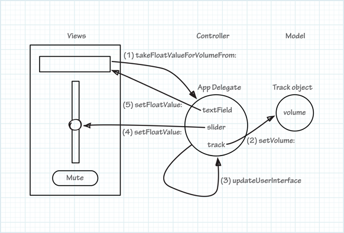

=========================
Actionメソッドの実装
=========================

app delegate のaction メソッドは、値を表示している複数のUI部品のうちの１つに値をセットしたときに、他のUI部品とオーディオトラックの音量を同期させる必要があります。
ユーザーがMuteボタンを押したときに、TextFieldとスライダーで表示されているトラック音量は、０にセットされなければなりません。
同じように、TextFiledに音量が入力されたりスライダーが動かされたら、変更を他のUI部品に反映しなければなりません。
「Model-View-Controller」デザインパターンにおいて、この動作を実装するのはControllerの役割です（ここでいうapp delegate）。

takeFloatValueForVolumeFrom:メソッドの実装
============================================

TextFieldとSliderは共に「takeFloatValueForVolumeFrom:」メッセージを送ります。
しかし、このメソッドはまだトラック音量やUI部品を更新していません。

takeFloatValueForVolumeFrom:メソッドを実装しよう
=================================================

- 「AppDelegate.m」ファイル内の「takeFloatValueForVolumeFrom:」メソッドを以下のように実装しましょう。

	.. code-block:: objective-c

		- (IBAction)takeFloatValueForVolumeFrom:(id)sender {
		    float newValue = [sender floatValue];
		    [self.track setVolume:newValue];
		    [self updateUserInterface];
		}

----------

このメソッドにいくつかの部分があります。

 - float newValue = [sender floatValue];
 
 	この行はsenderのfloat値を取得し、ローカル変数に格納します。このメッセージを送るsenderはTextFieldかSliderです。

 - [self.track setVolume:newValue];

 	この行はトラックの音量を新しい音量変更しています。

 - [self updateuesrInterface];

 	この行は、ユーザーインターフェースとトラック音量のつじつまがあうようにするための新しい関数を呼び出しています。

 	このメソッドはまだありません。ここにコードを書くことはできます。同じ機能が「mute:」メソッドにも必要ではありますが、ここにメソッド内に書けば良いので、一度だけ書けば問題ありません。

 Xcode上に `[self updateUserInterface]` の部分でエラーアイコンが表示されているのが分かるかと思います。
 これは、「updateUserIntaface」関数を定義も実装していないためです。
 次のように見えているでしょう。

 	.. image:: images/implementing_actions_methods/27c_compilererror.png

------------

updateUserInterfaceメソッドの実装
===================================

ユーザーインターフェースに表示する情報は、モデルに格納されているものと同期している必要があります。
このアプリケーションでは、音量は２カ所に表示されます。それらの内の１つが他のものを直接更新できれば魅力的ですが、そうすると管理やデバッグが難しくなる傾向があります。
こういったユーザーインターフェースの信頼性を維持する最善の方法は、常に実際の値としてModelオブジェクトを使用して、それに応じてつねにUIを同期させることです。
この実装では、以前に作成したTextFieldとSliderのoutletを使用します。.

ユーザーインターフェースを同期させよう
--------------------------------------

1. 「AppDelegate.h」ファイルに、以下のように「updateUserInterface」定義しましょう。

 	.. code-block:: objective-c

 		- (void)updateUserInterface();

2. 「AppDelegate.m」ファイルの「@end」の直前に、「updateUserInterface」を以下のように実装しましょう。

 	.. code-block:: objective-c

	 	- (void)updateUserInterface {
	 	    float volume = [self.track volume]
 		    [self.textField setFloatValue:volume];
 		    [self.slider setFloatValue:volume]
 		}

 	このメソッドは、最初にトラックの音量を取得して、それからTextFieldとSliderの両方にfloat値としてセットしている。

3. アプリケーションを実行してください。

 	このアプリケーションは期待通りに動くはずです。Sliderを動かすとTextFieldの値が更新され、値をTextFiledに入浴するとSliderが更新されるはずです。

---------

次のタスクで「Mute」ボタンのactionメソッドを実装して行きましょう。

---------

mute:メソッドを実装しましょう
==============================

1. 「AppDelegate.m」ファイルの「mute:」メソッドを以下のように変更してください。

 	.. code-block:: objective-c

 		- (IBAction)mute:(id)sender {
 		    [self.track setVolume:0.0];
 		    [self updateUserInterface];
 		}

2. アプリケーションを実行してください。

 	Muteボタンを押すとトラック音量が０にセットされ、TextFieldとSliderにも０がセットされるはずです。

-------------

これでアプリケーションが正しく動くようになりましたが、微妙なバグが含まれています。
nibフィアルの準備で、TextFiledとSliderの初期値入力しました（両方とも5です）。
しかし、アプリケーションを起動したとき、トラックが作成され、0がセットされています、
そこで、起動時にもユーザーインターフェースとModelの値の同期されることを保証しなければなりません。

--------------

ユーザーインターフェースが起動時に正しく動くようにしましょう
============================================================

起動時にユーザーインターフェースがModelの値と一致するためには、trackオブジェクトを作成した後に「updateUserInterface」メソッドを呼び出しましょう。

------

起動時にアプリケーションが正しく動くようにしよう
--------------------------------------------------

1. 「AppDelegate.m」ファイルでの「applicationDidFinishLaunching:」メソッドのtrackプロパティ設定後に「updateUserInterface」を呼び出すように更新しましょう。

	.. code-block:: objective-c

		Track* aTrack = [[Track alloc] init];
		[self setTrack:aTrack];
		[self updateUserInterface];

2. アプリケーションを起動してください。

	アプリケーション起動時に０が設定されること以外はだいたいこれまでと同じ通りに動いているはずです。

-----------

要約
===========

Modelデータを変更したときに複数のビューを更新するという、アプリケーションのコアとなる機能を提供する、app delgate のメソッドを実装しました。

次の章では、アプリケーションがどのように動作すれば、ユーザーエクスペリエンスが向上するかを見ていきましょう。
