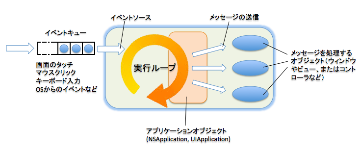

==========================
メッセージ送信のパターン
==========================

アプリケーションと実行ループ
==============================

　GUIを備えたMac OS X のアプリケーションも、iPhoneやiPadのアプリケーションも、メニューを選択したり、画面上をクリック（またはタップ）したり、あるいはキーボードを操作することで動作します。
これらのアプリケーションは、マウスクリック等のイベントをOSから受け取って、それに応じた処理を行うルーチンを起動する、ということを繰り返す部分を持っています。
これを、**実行ループ** (run loop)、あるいは *イベントループ* と呼びます。

　GUIを備えたCococaアプリケーションでは実行開始の直後に、必ず1つの実行ループが起動されます。これはメイン実行ループと呼ばれることがあります。
同時に、アプリケーションの動作やリソースの管理を行うオブジェクトが生成されます。これは、Mac OS Xでは **NSApplication** 、iOSでは **UIApplication** というクラスのインスタンスです。
このインスタンスが、OSから渡されたイベントに対応するオブジェクトを選び、適切なメッセージを送るという作業をします。

タイマオブジェクト
------------------------

　一定の時間が、あるいは良っって胃の時間間隔で、指定したメッセージ送信を行うための仕組みです。
タイマを上手く利用することで、並列処理を使わなければならないような動作でも簡単に実現できる場合があります。
Foundationフレームワークに用意されている **NSTimer** クラスを使用し、このNSTimerクラスのインスタンスはタイマオブジェクト、あるいは単にタイマと呼ばれます。
　タイマを利用するには、実行ループが必要です。タイマを実行ループに登録しておくと、指定した時間が経過した後で、指定しておいたメソッドが実行ループから起動されます。

.. code-block:: objective-c

	+ (NSTimer *) scheduledTimerWithTimeInterval: (NSTimerInterval) sec
	                                      target: (id)target
	                                    selector: (SEL)aSelector
	                                    userInfo: (id)userInfo
	                                     repeats: (BOOL)repeats

- sec
	ここで指定された秒数が経過するとタイマが起動する。NSTimerIntervalは実数で、現在はdouble型にtypedefされています。

- target
	ここで指定したターゲットにaSelectorのメッセージが送信される。

- aSelector
	ここで指定したセレクタのメッセージが、引数targetのオブジェクトに対して送信される。
	aSelectorにはタイマオブジェクトを１つだけ引数とするセレクタを指定します。メッセージが送られるときの引数はタイマオブジェクト自身です。

- userInfo
	メッセージに付加的な情報を付けたい場合には、情報を持ったオブジェクトをuserInfoに指定する。付加情報がない場合、引数userInfoはnilとします。

- repeats
	YESの場合には、指定した時間間隔で同じメッセージを繰り返し送信します。
	NOの場合は、メッセージを１回送信するだけです。

.. code-block:: objective-c

	- (id) userInfo

付加情報としてタイマオブジェクトに設定されているオブジェクトを返します。主に、タイマからメッセージを送られた側が情報を得るために使います。

.. code-block:: objective-c

	- (NSTimerInterval) timeInterval

タイマオブジェクトに設定されている時間間隔を返します。

.. code-block:: objective-c

	- (void) invalidate

タイマオブジェクトがこれ以降、起動しないように無効化し、実行ループから解放されるようにします。

メッセージの遅延実行
------------------------------

メッセージを時間をおいて後から実行するためのメソッドについて説明します。
このメソッドはNSObjectで定義されているため、どのオブジェクトに対しても使用できます。
これらのメソッドの実行には実行ループが必要です。

.. code-block:: objective-c

	- (void) performSelector: (SEL) aSelector
	              withObject: (id)anArgument
	              afterDelay: (NSTimerInterval) delay

このメッセージを送信してから、少なくともdelay秒経過してから、aSelectorの示すメッセージをanArgumentを引数としてレシーバに送信します。

.. code-block:: objective-c

	+ (void) cancelPreviousPrformRequestsWithTarget: (id)aTarget
	                                       selector: (SEL)aSelector
	                                     withObject: (id) anArgument

インスタンスメソッドperformSelector:withObject:afterDelayを使って登録された実行リクエストがあればキャンセルします。このメソッドでは、指定したセレクタと引数のオブジェクトも一致しなければなりませんが、メソッド **cancelPreviousPrformRequestsWithTarget:** ではターゲットだけが一致すればキャンセルできます。

デリゲート
=============================

デリゲートの概念
--------------------

デリゲートは、言語上の仕組みというよりは、オブジェクト同士が機能を分担し合って連携して動作する上での、典型的な１つの設計パターンであるということができます。
オブジェクト指向では一般に、デリゲート（あるいはデリゲーション）を、**「あるオブジェクトが、処理できないメッセージを受け取ったときに別のオブジェクトに処理を代行してもらう機構」** であると説明しています。

Cocoa環境のデリゲート
---------------------------

　Cocoa環境の場合には、処理できないメッセージというよりも、そのアプリケーションに必要とされる処理を付け加えるための「増設」オブジェクトといった感じが近いです。

アンドゥ機構
=====================

　Cocoa環境では、一度行った操作を取り消し（アンドゥ:undo）したり、再びやり直し（リドゥ:redo）したりするために、専門のクラス **NSUndoManager** を備えています。
　いったん行った操作を取り消すには、操作前の状態を記録しておいて元に戻す方法と、行った操作と逆の効果を持つ操作を行う方法が考えられますが、NSUndoManagerは後者の方法によてUndoを実装します。

　複数のドキュメントウィンドウがあるアプリケーションでは、ウィンドウ毎1つのアンドゥマネージャを備えると良いでしょう。アプリケーションによっては１つに限定することもできます、なお、ApplicationフレームワークのNSDocumentクラスを用いてドキュメントウィンドウのクラスを管理を行うアプリケーションでは、NSDocumentのインスタンスからアンドゥマネージャを取得することができます。

　アンドゥの仕組みは、基本的にはアプリケーションで何らかの操作を行う際に、同時に逆の作用を持つメッセージ（あるいはメッセージ群）をアンドゥマネージャに記録します。
アンドゥの要求があった時点で最新の記録内容を取り出して実行します。

　アンドゥの実行としてメソッドを実行した場合にも、メソッド内から「アンドゥマネージャへの記録」が実行されますが、NSUndoManagerは **アンドゥの実行中に「アンドゥマネージャへの記録」が行われると、そのメッセージをリドゥ用のスタックに記録する** のです。

アンドゥマネージャに操作を記録する
------------------------------------

アンドゥマネージャへ操作を記録するには２つの方法があります。

.. code-block:: objective-c

	- (void) registerUndoWithTarget: (id) target
	                       selector: (SEL) aSelector
	                         object: (id) anObject

.. code-block:: objective-c

	- (void) prepareWithInvocationTarget: (id) target

