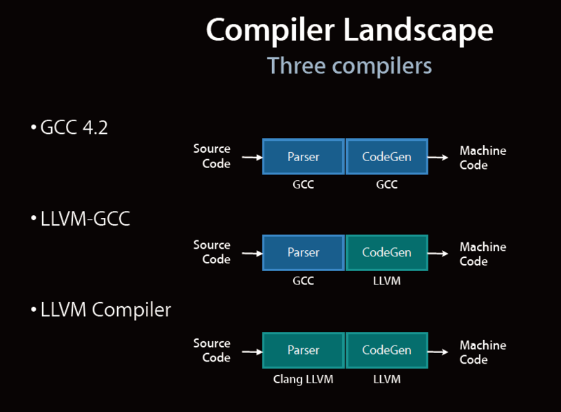

==================================
Xcodeのコンパイラの種類とその違い
==================================

Xcode 4 からコンパイラのデフォルトが「GCC 4.2」から「LLVM GCC」に変更されました。
また、コンパイラの選択項目には「Apple LLVM Compiler x.x」という項目があります。
これらの違いを見ていきましょう。

GCC、LLVM GCC、Apple LLVM Compiler の違い
============================================

WWDCのスライドによると、それぞれのコンパイラには以下のような違いがあります。

====================== =====================================
 コンパイラ              パースと機械語生成
====================== =====================================
GCC                     GCCでパースして、GCCでバイナリ生成   
LLVM GCC                GCCでパースして、LLVMでバイナリ生成  
Apple LLVM Compiler     clangでパースして、LLVMでバイナリ生成
====================== =====================================

clang Paserを使用するメリット
---------------------------------

- コンパイラが高速
	- およそ３倍速いらしい
- エラー、ワーニングメッセージの改善
	- メッセージが分かりやすくなったらしい

Apple LLVM Compiler について
==============================

Apple LLVM Compiler は、従来のGCCコンパイラを置き換えるものです。

- LLVMの特徴

	- コンパイルが速い
	- コンパイルされたコードが速い
	- エラーメッセージが分かりやすい
	- 他のツールと連携しやすい

LLVMにある様々なプロジェクトの中で、Xcodeのコンパイラとして関係しているのは以下の２つです。

- LLVM Core
	- 最適化やコード生成機能を持つ.

- clang
	- LLVM Coreに対する C/C++/Objective-C 用のフロントエンド.

LLVM の特徴のうち、高速なコンパイルや分かりやすいエラーメッセージというのはClangが実現しており、高速なコードの生成は LLVM Core が担っています。

ClangはGCCとはまったく別のパーサなので、GCCではコンパイルできるコードがClangではエラーになるというケースもあり得ます。

LLVM GCCについて
===================

Xcode4.0では、Clangも搭載されていますが、デフォルトのコンパイラは LLVM GCC という別のフロントエンドになっています。
LLVM GCC もLLVM.org で開発されているものの1つですが、これは前述の通りパーサにGCCを使用し、最適化やオブジェクトコード生成を LLVM Core で行っています。
つまり、LLVM Core の高度な最適化などの恩恵を受けつつ、「これまで GCC でコンパイルできていたソースコードがコンパイルエラーになる」とう状況がほぼなくなります。

