#####################################
減算合成方式シンセサイザーの構造
#####################################

.. note::

	以下のWebサイトの内容を記載しています.

	- http://www.groovecube.com/ja/tutorial/architecture.html

本章から先は減算合成方式に的を絞り、シンセサイザーの構造と音色作成のテクニックについて詳しく解説していきます。まず本章は減算合成方式シンセサイザーの基本構成と各要素の役割について説明します。

はじめに減算合成方式シンセサイザーの基本構成を下図に示します。まずオシレーターで音色の元となる波形を合成します。オシレーターの波形は単純な形をしていますが色々な周波数成分を含んでいます。これをフィルターに通して周波数成分を調整し、最後にアンプリファイヤーで音の強弱をつけて最終的な音色ができあがります。

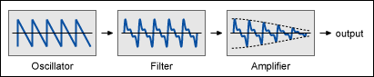

	**　　　　減算合成方式シンセサイザーの基本構成**

実際のシンセサイザーはもう少し複雑で、オシレーターやフィルターなどの構成要素をいろいろ組み合わせて多種多様な音色を作成することができます。これら「部品」には大きく分けて2種類あります。第1のグループは音声(オーディオ)信号を発生したり処理したりするもの、もう1種類は音声信号に変化を与えるためのモジュレーション信号を発生するものです。

***********************************
音声信号を発生/処理するもの
***********************************

音声信号を発生したり、変化を与えたりするグループです。シンセサイザーにおけるいわゆる「主役」達です。

- オシレーター(Oscillator) : 音声信号を発生します
- ミキサー(Mixer) : 複数の音声信号を強度調整して１つにまとめます
- フィルター(Filter) : 音声信号の周波数成分をカットしたり強調したりします
- アンプリファイヤー(Amplifier) : 音声信号に強弱の変化を与えます

これらの多くは外部から別の信号を加えることによって音声信号に変化を与えることができます。
これをモジュレーション(Modulation)といい、また外部から加える信号のことをモジュレーション信号といいます。
モジュレーションを用いることにより音声信号に時間的変化を与え、音色を変化させたり表情を加えたりすることができます。

**********************************************************************
モジュレーション信号を発生するもの(モジュレーションソース)
**********************************************************************

音声信号に変化を与えるためのモジュレーション信号を発生します。これらはシンセサイザーの「脇役」的な存在と言えますが、音色に時間変化を与える重要な役目を持っています。これらを総称してモジュレーションソース(Modulation Source)といいます。

- エンベロープ(Envelope) : キーボードのON/OFFに対して強弱信号を発生します
- LFO : 一定周期でゆっくりと変化する信号を発生します

音声信号は周波数が50～20000Hz程度の変化の速い信号ですが、一般にモジュレーション信号の変化はずっと遅く人間が波形の変化を直接判別できる程度(だいたい0.1～10Hz)の速さです。モジュレーション信号は音に人間が判別できる変化を加え、音色や音の強弱に変化を与えたり微妙な表情を加えたりすることができます。

.. note::

	Excitonの場合これら2種類をはっきり区別していますが、シンセサイザーの中には音声信号自身をモジュレーションに用いるものもあります。例えばオシレーターのモジュレーションに別のオシレーターを用いて周波数や位相に速い変化を与えることにより複雑な信号波形を発生することができます。これはYAMAHA DX7などのFM方式シンセサイザーで用いられている方法です。

それではこれらの構成要素について1つ1つ説明していきます。

------

************************************
オシレーター(Oscillator)
************************************

音の元となる波形を生成します。アナログシンセサイザーではその回路方式からVCO(Voltage Controlled Oscillator)と呼ばれることがあります。

Excitonのオシレーターはサイン波、三角波、のこぎり波、パルス波の計4種類の波形を発生することができます。またこの他にノイズ発生器を1つ持っています。これらはそれぞれ異なる周波数成分を持っており、音のキャラクターを決める重要な要素になります。

サイン波(Sine Wave)
=============================

もっとも基本的な波形です。下図の左半分に波形、右半分に周波数分布を示します。図のように滑らかな波形で一種類の周波数成分(基音)だけを持ちます。

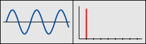
	
	**　　　　　　　サイン波**

のこぎり波(Sawtooth Wave)
==================================

図のようにギザギザした波形で、基音とともに2倍音(強度1/2)、3倍音(強度1/3)、...、というように整数倍の倍音成分を持ちます。基音の整数倍の倍音成分を持つのは弦楽器や管楽器の音と共通した性質で、のこぎり波を出発点としてフィルターで加工することにより多様な音色を得ることができます。実際にオシレーターの生音(ExcitonはフィルターをOFFにできます)を聞くと分かりますが、基音が低い場合でも多くの倍音成分を含む鋭い感じの音色です。この一部をフィルターでカットして倍音成分を調整することによりいろいろな音色を作り出すことができます。

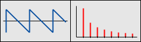
	 
	**　　　　　　のこぎり波**

三角波(Triangle Wave)
================================

二等辺三角形の波形です。聴感上はサイン波に近い感じですが少しだけ倍音成分を持ちます。

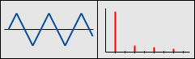
	
	**　　　　　　　三角波**

パルス波(Pulse Wave)
=============================

長方形を組み合わせた波形です。のこぎり波と同様に多くの倍音成分を持ちますが、倍音成分の分布をパルス幅を変えることによって変化させることができます。パルス幅50%の時は基音、3倍、5倍、...、というように奇数次の倍音成分のみを持っていますが、パルス幅を細くしていくと偶数次の成分が現れさらに奇数次の倍音の割合も増大していきます。

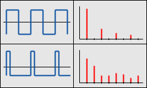

	**　　　　　　　パルス波**

ノイズ(Noise)
=======================

信号が一定幅の中にランダムに分布します。基音や倍音というものはなく全周波数帯域に一様に強度成分が分布します。Excitonはノイズ発生器をミキサーユニットの中に内蔵しており、フィルターで高音成分の量を調整することができます。

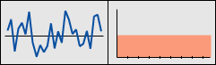
	
	**　　　　　　　ノイズ**

またオシレーターはエンベロープやLFOなどのモジュレーション信号を用いてその音程に変化を加えることができます。Excitonのオシレーターは2つのエンベロープ、2つのLFOの計4つのモジュレーション信号の中から2種類まで自由に選択して音程(ピッチ)変化に用いることができます。またパルス波を用いている場合はモジュレーション信号を用いてパルス幅を変化させることもできます。

************************************
ミキサー(Mixer)
************************************

オシレーターやノイズそれぞれの信号をミックスして1つにまとめます。Excitonはオシレーターを2つ、ノイズ発生器をミキサーユニットの中に1つ持っており、ミキサーでそれぞれの強度を調整して1つの信号にまとめます。ミキサーの設定を変えることにより倍音成分や位相の異なる波形を「調合」していろいろな波形を合成することができます。

またExcitonでは2つのオシレーターを掛け合わせた信号もミックスすることができます。2つの信号を掛け合わせることをリングモジュレーションと言います。リングモジュレーションを用いることにより元の波形にはない新たな周波数成分を合成することができます。

************************************
フィルター(Filter)
************************************

ミキサーで1つにまとめられた波形から倍音成分の一部分を取り除いたり逆に強調したりします。アナログシンセサイザーではその回路方式からVCF(Voltage Controlled Filter)と呼ばれることがあります。

一般にフィルターにはたくさんの種類がありますが、Excitonではローパスフィルター、ハイパスフィルターの2種類を用いています。ローパスフィルターは設定した周波数より低い周波数成分を通し、それ以上をカットします。設定周波数のことをカットオフ周波数(Cutoff Frequency)といいます。ハイパスフィルターはローパスフィルターの逆でカットオフ周波数より上を通し、下側をカットします。

カットするといってもカットオフ周波数から先を完全に除去するというわけではなく、実際のフィルターはカットオフ周波数を境としてその先を徐々に減衰させます。それぞれの特性の概要を下図に示します。左がローパスフィルター、右がハイパスフィルターの特性です。Excitonのフィルターはどちらも減衰の傾き(スロープ)を6dB/Oct、12dB/Oct、18dB/Oct、24dB/Octの中から選択できます。

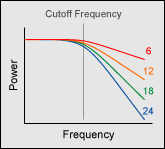

	**　　ローパスフィルター**

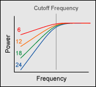

	**　　ハイパスフィルター**

.. note::

	スロープの単位に用いられている"dB/Oct"とは「デシベル/オクターブ」のことです。6dB/Octとは1オクターブ上(または下)で強度が6dB低下すること、別の言い方では周波数が倍(または半分)になると強度が1/2になることを示します。同様にカットオフ周波数より先では12dB/Octでは1オクターブあたり強度が1/4、18dB/Octでは1/8、24dB/Octでは1/16の割合でカットされます。

フィルターは信号の一部をカットするだけではなく、逆に強調することもできます。スロープが12,18,24dB/Octのフィルターではレゾナンスを用いてカットオフ周波数付近の強度を強調することができます。下図でレゾナンスなしの特性が青い曲線、レゾナンスを利かせたのがオレンジ(レゾナンス中)、赤(レゾナンス強)の曲線です。

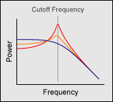

	**　ローパスフィルターのレゾナンス**

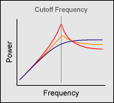

	**　　ハイパスフィルターのレゾナンス**

.. note:: 

	レゾナンス(Resonance)は英語で「共振」を意味し、フィルターにフィードバックをかけて信号を共振させることによりカットオフ周波数付近の強度を持ち上げます。6dB/Octのフィルターはフィードバック共振をかけることができないためレゾナンス機能はありません。

またフィルターはエンベロープやLFOなどの外部信号を用いてそのカットオフ周波数に変化を加えることができます。Excitonのフィルターは2つのエンベロープ、2つのLFOの計4つの外部信号の中から2種類まで自由に選択して音程変化に用いることができます。またこれらをレゾナンスの変化に用いることもできます。

************************************
アンプリファイヤー(Amplifier)
************************************

音声信号に強弱の変化を加えます。アナログシンセサイザーではその回路方式からVCA(Voltage Controlled Amplifier)と呼ばれることがあります。

アンプリファイヤーはフィルター通過後の音声信号にエンベロープを用いて強弱変化を加えます。ExcitonではさらにLFOによる強弱変化も付け加えることができます。またキーの強弱(ベロシティー)に対する音の強弱変化もアンプリファイヤーで設定します。

************************************
エンベロープ(Envelope)
************************************

キーボード(MIDIノート)のON/OFFに応じて強度を変える信号を発生します。これらはオシレーター、フィルター、アンプリファイヤーのモジュレーションに用いられます。

Excitonは多くのアナログシンセサイザーで用いられているADSR方式のエンベロープを2系統持っています。ADSRエンベロープはキーボード(MIDIノート)のON/OFFに対して下図のような信号を発生します。

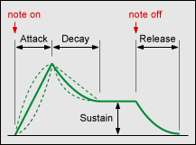
	
	**　　ADSRエンベロープ**

ADSRエンベロープ
=======================

- アタックタイム(Attack Time)
	- ノートオンメッセージ受信から立ち上がり完了までの時間
- ディケイタイム(Decay Time)
	- 立ち上がり完了から立下り完了までの時間
- サスティーンレベル(Sustain Level)
	- 立下り状態の信号レベル(立ち上がり終了時を100%として指定)
- リリースタイム(Release Time)
	- ノートオフメッセージ受信からレベルがゼロに戻るまでの時間

またExcitonではアタックの曲線を設定できます。凹、直線、凸の3通りが設定可能です。

.. note:: 
	
	ADSR方式以外のエンベロープを採用しているものも数多くあります。例えばRoland TB-303のエンベロープはディケイのノブしかなく、他の設定は固定されています(元々ベース音用に作られているのでそれで十分ということです)。一方YAMAHA DX7以降のデジタルシンセサイザーの多くはアタックやディケイのカーブを細かく設定できるなど複雑なエンベロープを持っています。ただ実用上はADSRで十分なことが多いため、Excitonでは必要以上に機能を増やすのを避けADSR方式を採用しています。

-----

************************************
LFO
************************************

オシレーター、フィルター、アンプリファイヤーのモジュレーションに用いる遅い周波数の波形を発生します。英語名(Low Frequency Oscillator)の頭文字を取ってLFOと呼ばれます。

LFO波形はオシレーターと比べて周波数が極端に遅いことを除けば基本的には同じものですが用途は全く異なり、モジュレーションソースとして用いられます。音源のオシレーターは波形によって音色が異なりますが、LFOの場合は波形によって用途が異なります。具体的な使用方法についてはビブラートやLFOの応用で詳しく説明します。

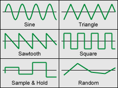

	**　　LFO波形の種類**

LFO波形の種類
====================

- サイン波(Sine)
	- 緩やかに上下する周期モジュレーション信号です。音に周期な変動を加えるのに用いられます。
- 三角波(Triangle)
	- 上下に直線的に変化します。用途はサイン波とほぼ同じですが曲線の違いから少し違った効果が得られます。
- のこぎり波(Sawtooth)
	- 一定方向に変化して元に戻る周期信号です。主に効果音の作成に用いられます。
- 方形波(Square)
	- 幅50%のパルス波です。主に音を周期的にスイッチするのに用いられます。
- サンプルホールド(Sample & Hold)
	- 一定時間おきに値が飛び飛びに不規則変化します。主に人工的・機械的な音の作成に用いられます。
- ランダム(Random)
	- 値がランダムに連続変化します。音に不規則な変動を加えるのに用いられます。

